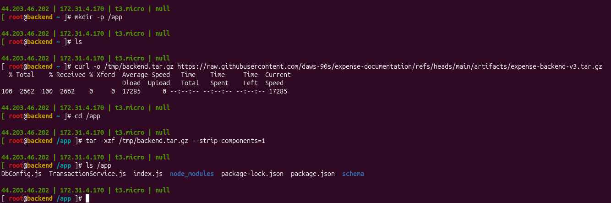
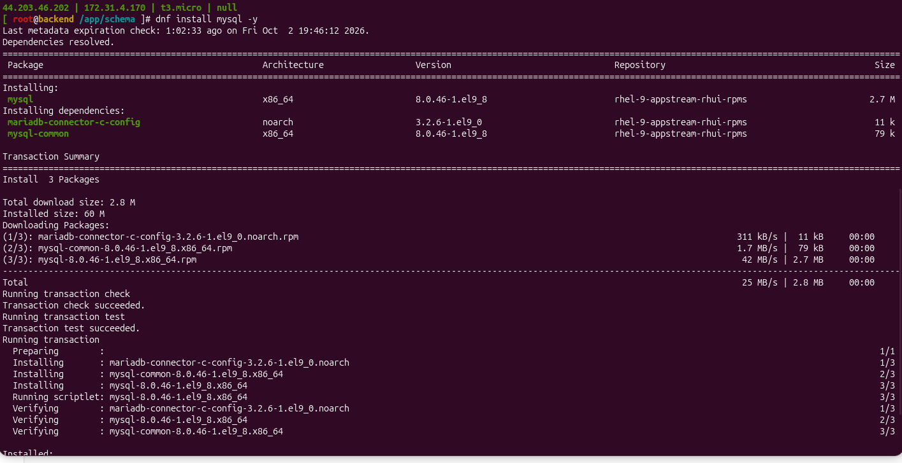
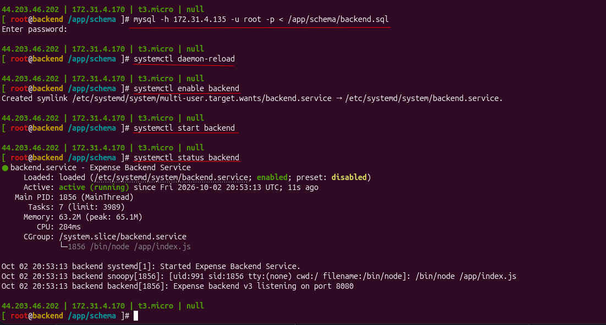
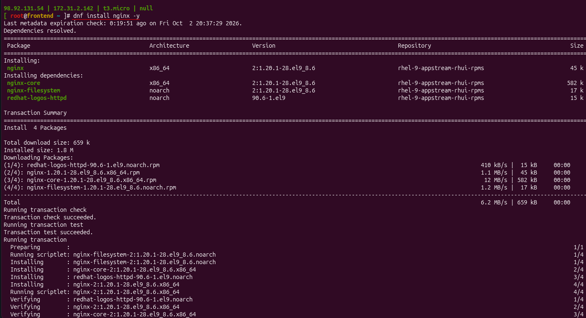
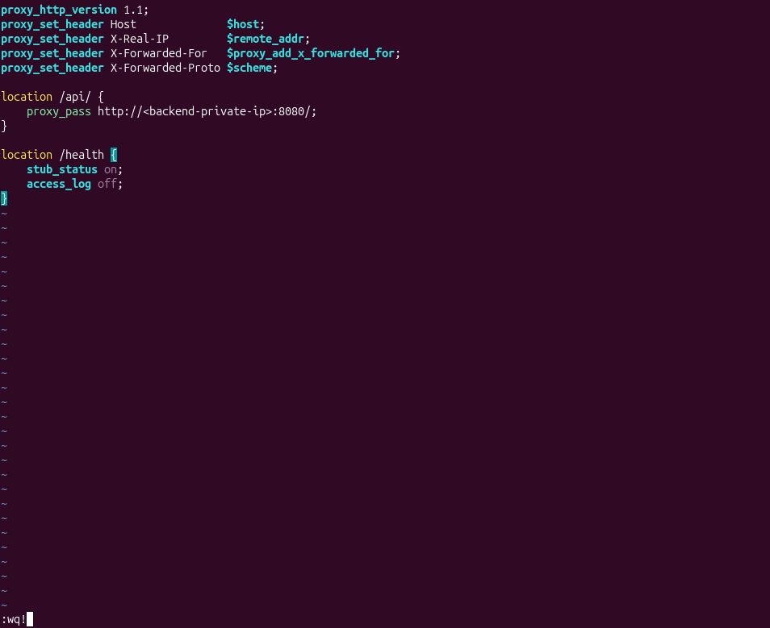
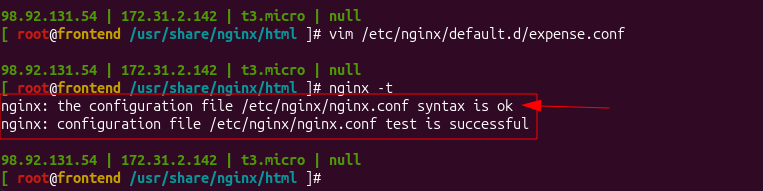

# Day 7 - Hands-On: Expense App Setup

[← Back to Day 7 notes](../README.md)

My actual run of the setup, with the mistakes I hit and how I fixed them.

## Backend

**1. Create `/app`, download the code and extract it**



`/app` now has the code: `index.js`, `package.json`, `package-lock.json`, `node_modules/` and `schema/`.

**2. Write the service file, then check the schema file**


The schema is inside `/app/schema/backend.sql`, given by the developers with the code (password hidden here).

**3. Install the MySQL client on the backend**



Only the `mysql` client is installed here, not `mysql-server`.

**4. Load the schema, then start the backend**



- `mysql -h <db-private-ip> -u root -p < ...` → asks for the **MySQL root password** (set on the DB server). No output = success.
- `daemon-reload` → `enable` → `start` → `status` shows **active (running)**.
- Log line: `Expense backend v3 listening on port 8080`.

**5. Verify the backend**


- `ps -ef | grep node` → process owner is **`expense`**, not root.
- `netstat -lntp` → `node` listening on **8080**.
- `curl http://localhost:8080/health` → `{"status":"ok"}`.

## Frontend

**6. Install Nginx**



**7. Mistake 1 - placeholder left in the config**

I copied the config but didn't replace `<backend-private-ip>`:



`nginx -t` caught it:


```
nginx: [emerg] host not found in upstream "<backend-private-ip>"
nginx: configuration file /etc/nginx/nginx.conf test failed
```

**Fix:** put the backend's real private IP in `proxy_pass`:




**8. Mistake 2 - didn't restart Nginx (on purpose, to see the error)**

The config was correct and `nginx -t` passed, but I didn't restart Nginx. Calling the API still gave **404**:


Nginx was still running with the **old** config, which has no `/api/` rule. So it looked for a file called `api/health` in `/usr/share/nginx/html` and returned 404.

**9. Restart Nginx → working**


After `systemctl restart nginx`, `curl http://localhost/api/health` → `{"status":"ok"}`. The request now goes frontend → Nginx → backend → DB. ✅

**Lesson:** a correct config file does nothing until Nginx is restarted. Error page "Not Found" right after a config change → restart first, then debug.
