# Day 7 - Hands-On: Expense App Setup

[← Back to Day 7 notes](../README.md)

My actual run of the setup on AWS, step by step, with the mistakes I hit and how I fixed them.

> Passwords, my home IP and AWS account ID are blacked out in the screenshots.

## Contents

1. [AWS - Instances and Security Groups](#1-aws---instances-and-security-groups)
2. [Set Hostnames](#2-set-hostnames)
3. [Database Server (MySQL)](#3-database-server-mysql)
4. [Backend Server (Node.js)](#4-backend-server-nodejs)
5. [Frontend Server (Nginx)](#5-frontend-server-nginx)
6. [App in the Browser](#6-app-in-the-browser)
7. [Lessons](#7-lessons)

---

## 1. AWS - Instances and Security Groups

**3 instances running** - `frontend`, `mysql`, `backend` (t3.micro, us-east-1a), each with its own security group:

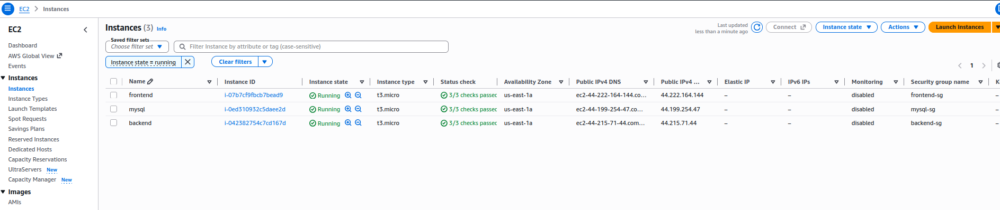

**frontend-sg** - HTTP 80 from anywhere (`0.0.0.0/0`), SSH 22 from my IP:

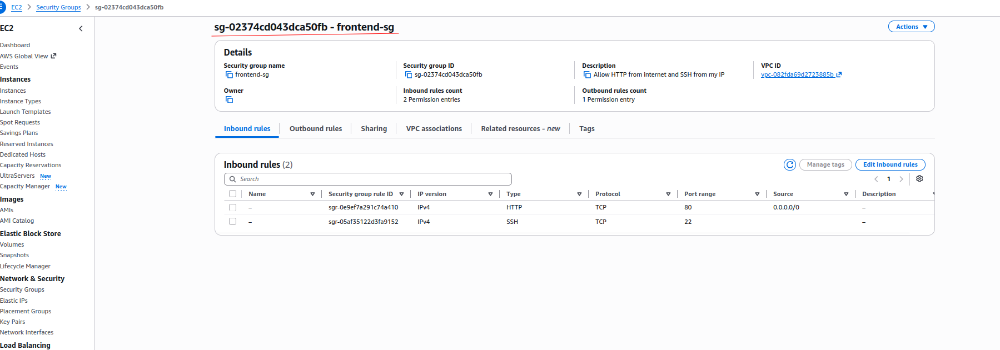

**backend-sg** - SSH 22 from my IP, port **8080 only from `frontend-sg`**:

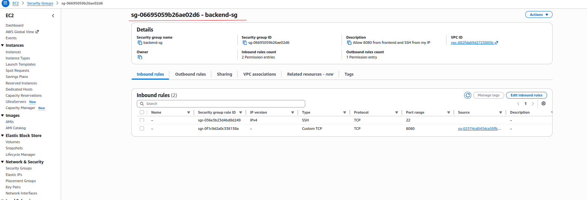

**mysql-sg** - SSH 22 from my IP, **MySQL 3306 only from `backend-sg`**:

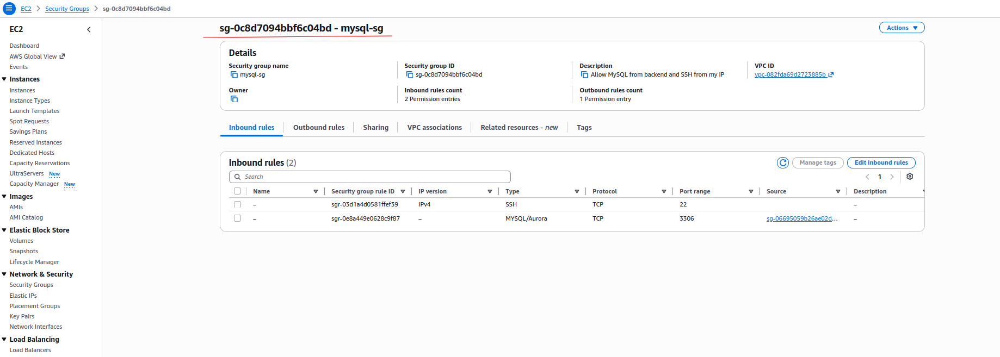

Adding the rules - for 3306 the source is **Custom → `backend-sg`** (not an IP), so any backend server in that group can reach the DB:

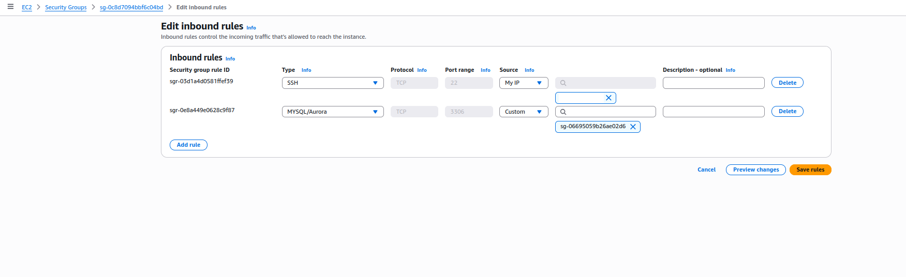

---

## 2. Set Hostnames

By default the prompt shows `ip-172-31-4-135`, which is hard to tell apart. Set a clear name on each server:

```bash
sudo su -
hostnamectl set-hostname mysql     # backend / frontend on the other servers
exec bash                          # reload the shell to see the new name
```

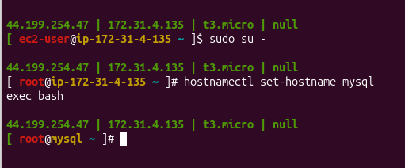

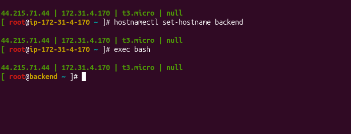


Now the prompt shows `root@mysql`, `root@backend`, `root@frontend`, so I always know which server I'm on.

---

## 3. Database Server (MySQL)

**Install MySQL server**

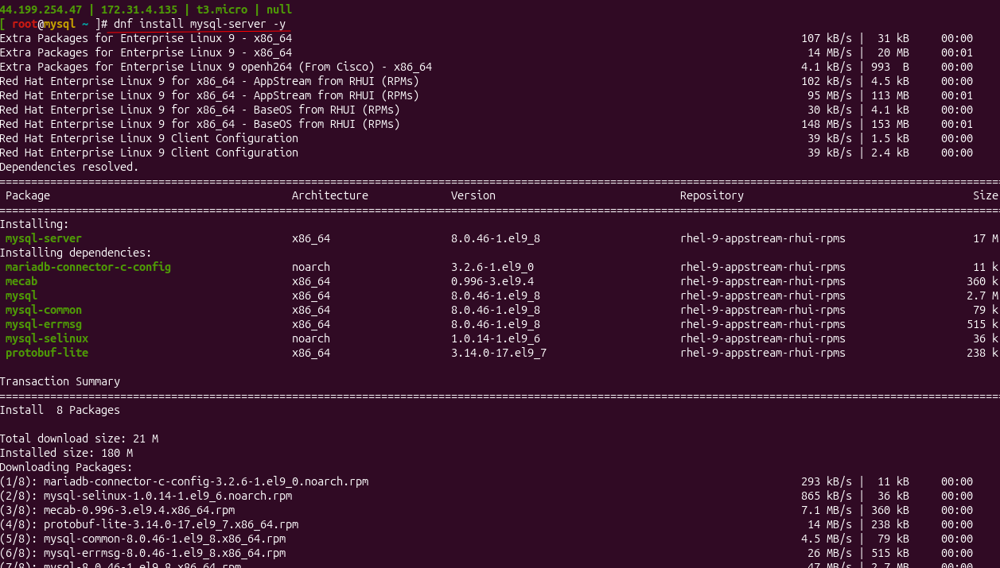

**Enable and start it** → `active (running)`:

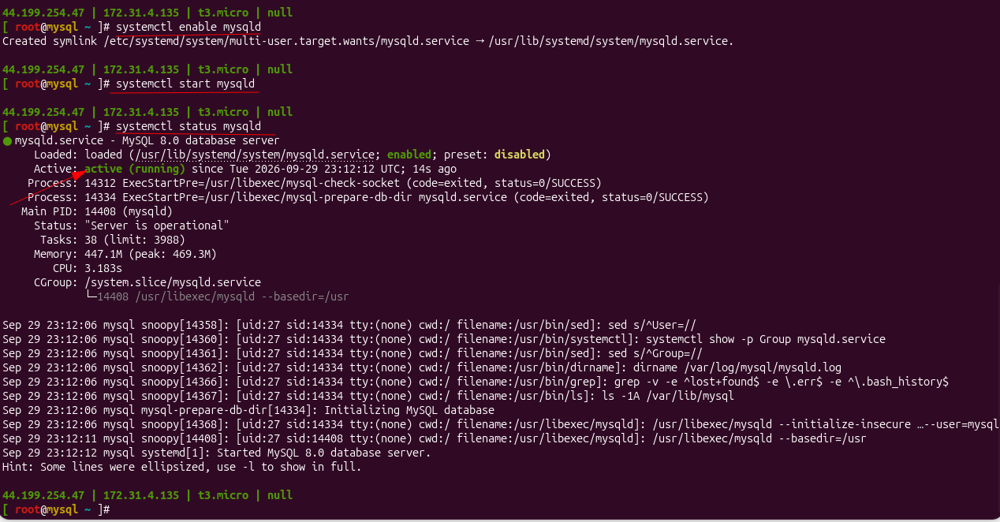

**Set the root password, then check the port** → `mysqld` is listening on **3306**:

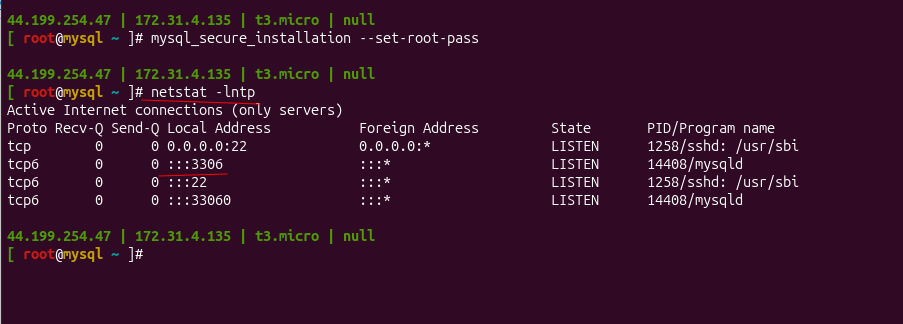

**Log in to check it works** → `mysql>` prompt:

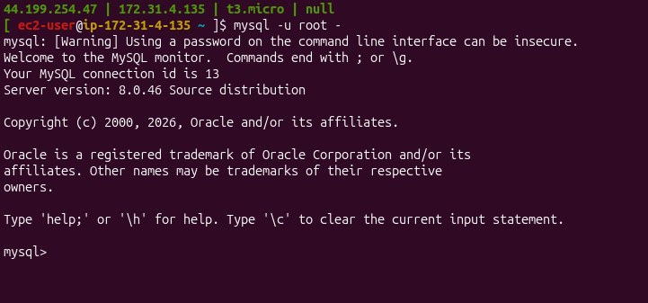

The warning `Using a password on the command line interface can be insecure` is because the password was typed right after `-p`. Better: use only `-p` and type the password when asked, so it doesn't stay in the shell history.

---

## 4. Backend Server (Node.js)

**Check Node.js versions, disable the default one**

`dnf module list nodejs` shows streams 18, 20, 22, 24. The default is old, so disable it:

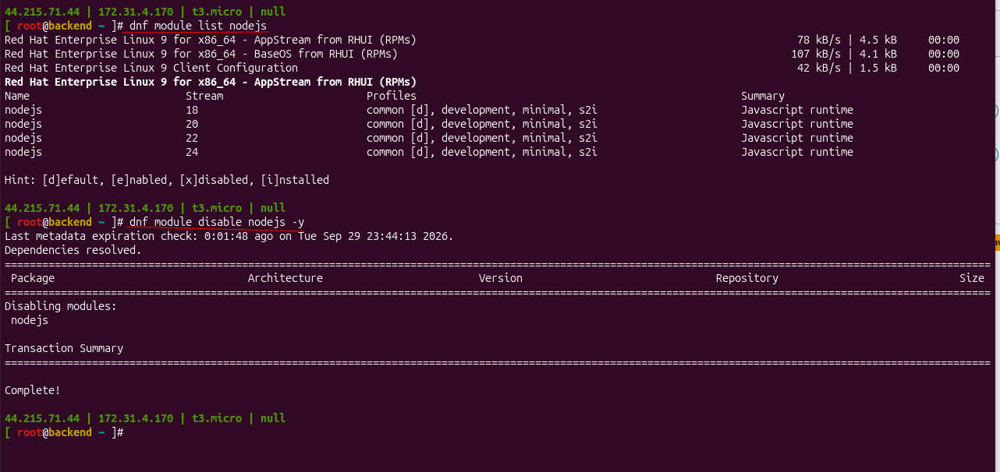

**Enable Node.js 24 and install**

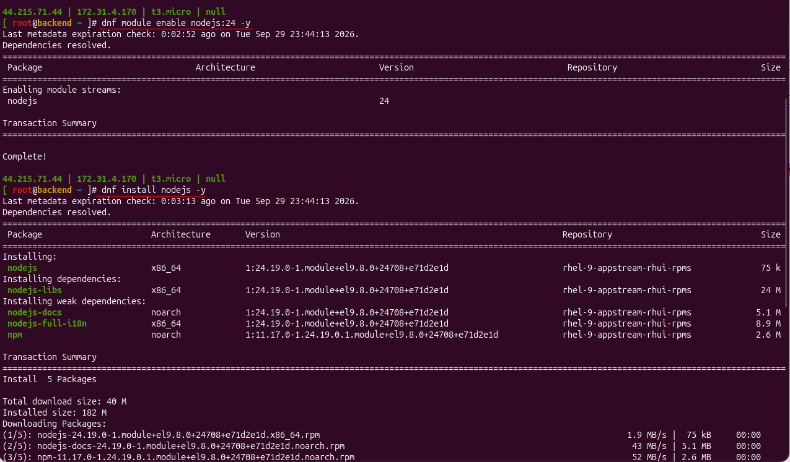

**Check the version** → `v24.19.0`:

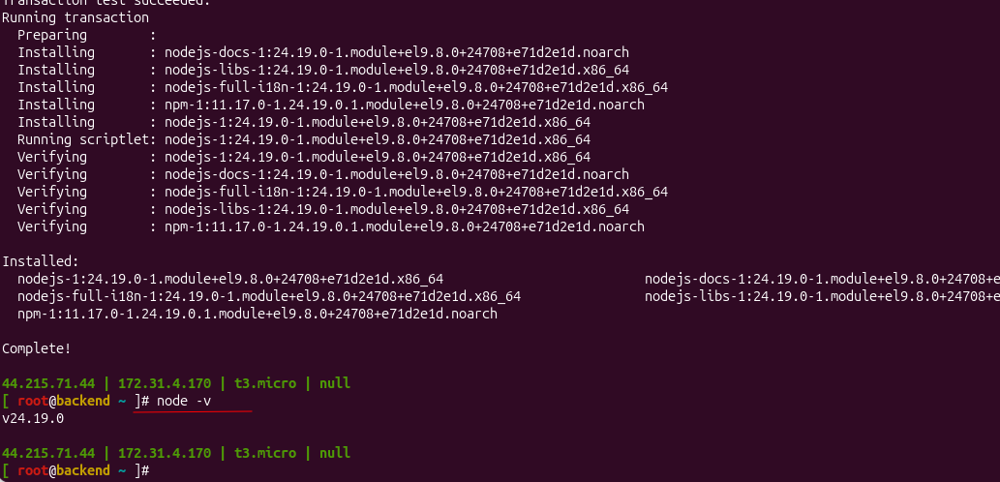

**Create the system user and `/app`** (as root)

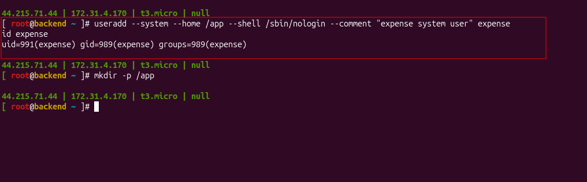

**Check the user was created**

- `id expense` → UID **991**, below 1000, so it's a system user.
- `/etc/passwd` → home `/app`, shell `/sbin/nologin`.


**Download and extract the code (first try)**

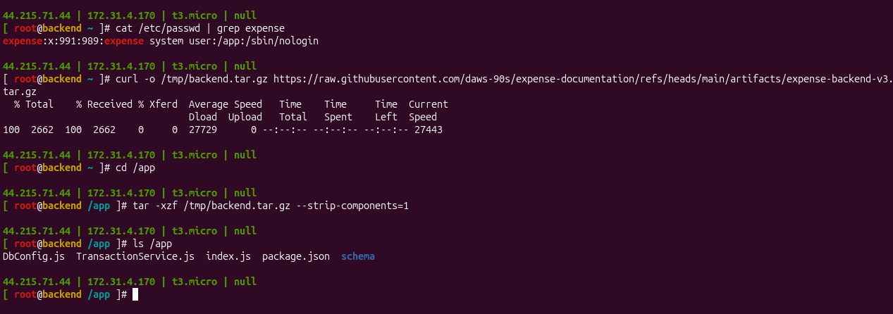

At this point `/app` only has `DbConfig.js`, `TransactionService.js`, `index.js`, `package.json` and `schema/` - no `node_modules/` yet, because `npm install` hasn't run.

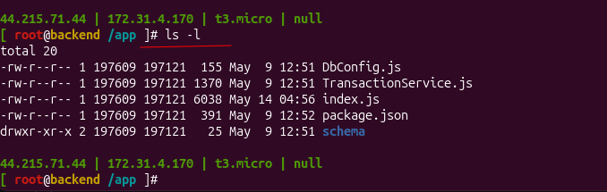

`ls -l` shows the owner as `197609 197121` - numbers, not names. `tar` kept the UID/GID from the developer's machine, and no user with those IDs exists on this server, so Linux shows the raw numbers.

**Download again, extract, and after `npm install`**


Now `/app` also has `node_modules/` and `package-lock.json`.

**Write the service file, then check the schema file**

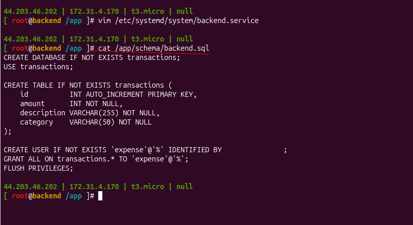

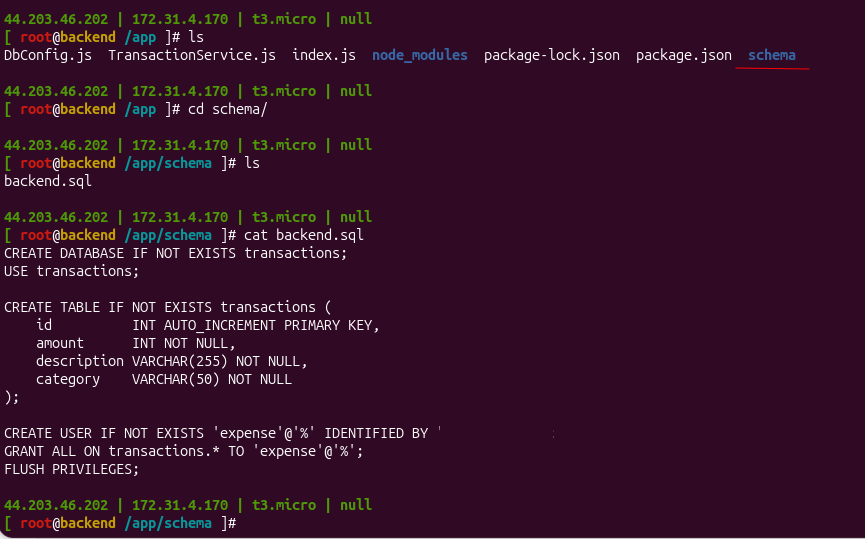

The schema is inside `/app/schema/backend.sql`, given by the developers with the code.

**Install the MySQL client on the backend**


Only the `mysql` client is installed here, not `mysql-server`.

**Load the schema, then start the backend**


- `mysql -h <db-private-ip> -u root -p < ...` → asks for the **MySQL root password** (set on the DB server). No output = success.
- `daemon-reload` → `enable` → `start` → `status` shows **active (running)**.
- Log line: `Expense backend v3 listening on port 8080`.

**Verify the backend**

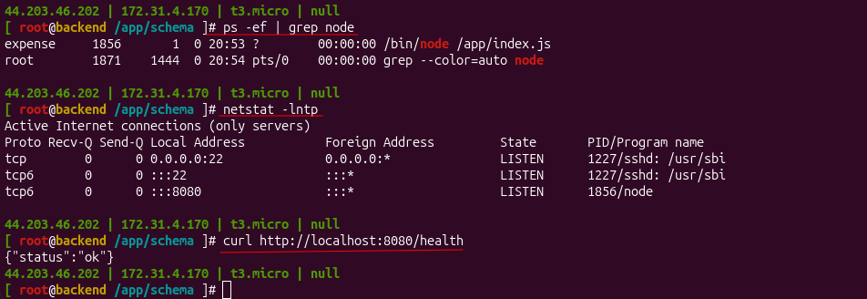

- `ps -ef | grep node` → process owner is **`expense`**, not root.
- `netstat -lntp` → `node` listening on **8080**.
- `curl http://localhost:8080/health` → `{"status":"ok"}`.

---

## 5. Frontend Server (Nginx)

**Install Nginx**


**Mistake 1 - placeholder left in the config**

I copied the config but didn't replace `<backend-private-ip>`:


`nginx -t` caught it:

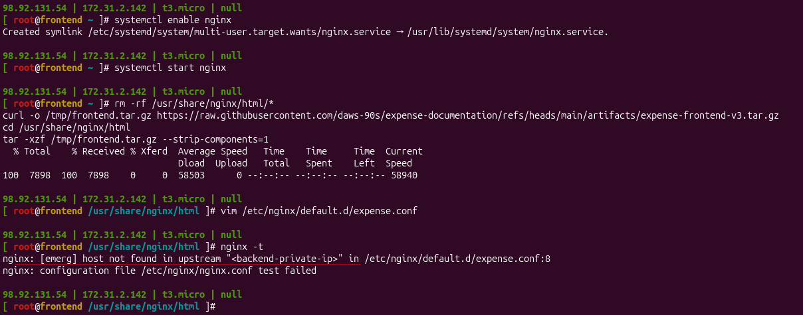

```
nginx: [emerg] host not found in upstream "<backend-private-ip>"
nginx: configuration file /etc/nginx/nginx.conf test failed
```

**Fix:** put the backend's real private IP in `proxy_pass`:

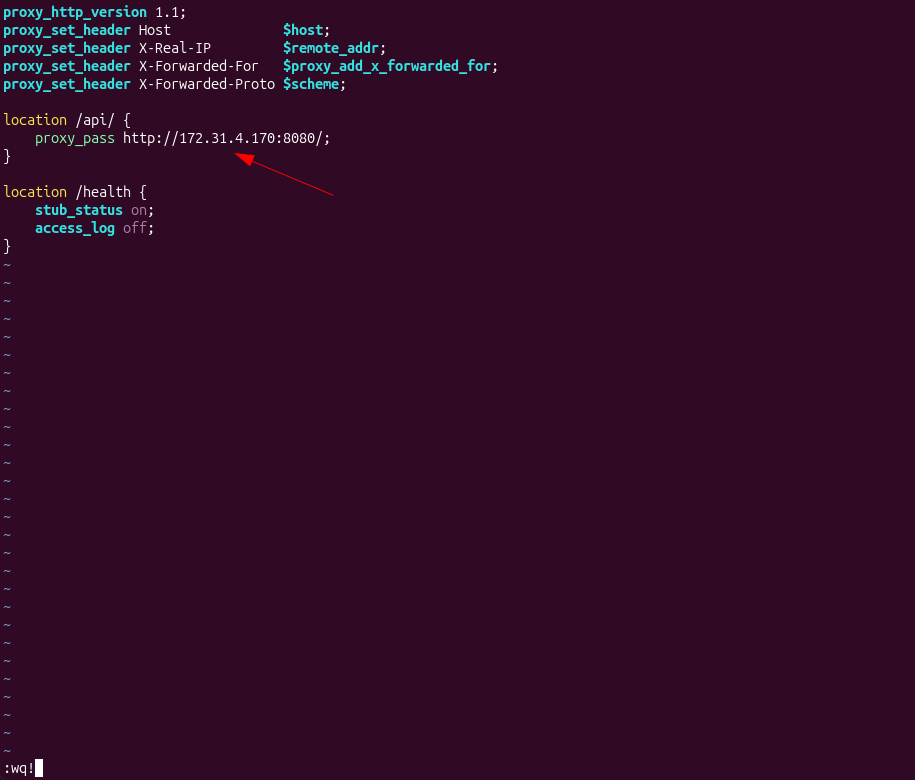


**Mistake 2 - didn't restart Nginx (on purpose, to see the error)**

The config was correct and `nginx -t` passed, but I didn't restart Nginx. Calling the API still gave **404**:

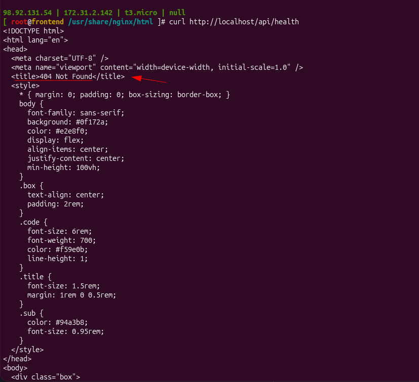

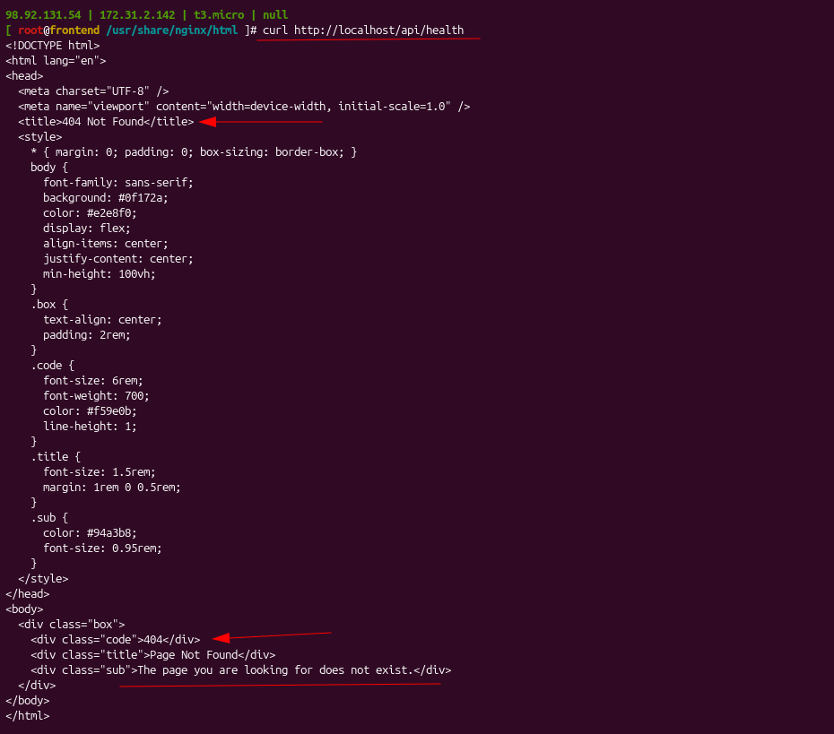

Nginx was still running with the **old** config, which has no `/api/` rule. So it looked for a file called `api/health` in `/usr/share/nginx/html` and returned 404.

**Restart Nginx → working**

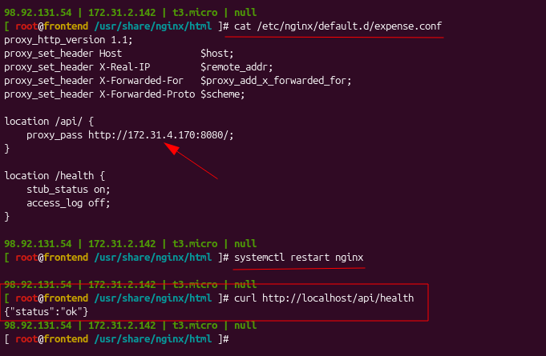

After `systemctl restart nginx`, `curl http://localhost/api/health` → `{"status":"ok"}`. ✅

---

## 6. App in the Browser

`http://<frontend-public-ip>` → the Expense Tracker loads. No expenses yet:

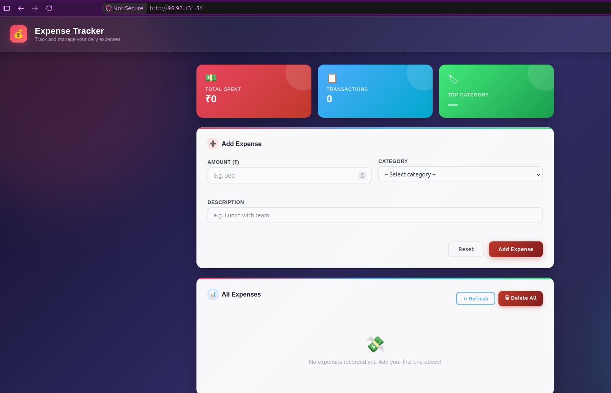

Added 5 expenses. They're saved in the database and show up in the table, and the totals at the top update:

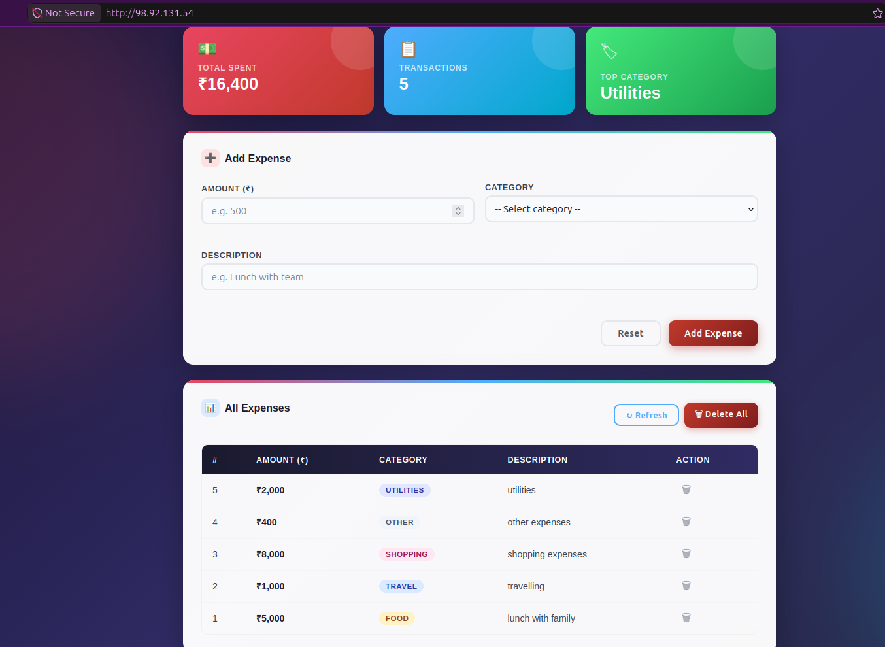

This proves the full 3-tier flow: **browser → Nginx (frontend) → Node.js (backend) → MySQL (DB)** and back. ✅

---

## 7. Lessons

1. **Restart after config changes.** A correct config file does nothing until Nginx is restarted. "Not Found" right after a change → restart first, then debug.
2. **Always run `nginx -t`** before restarting - it caught the placeholder I forgot to replace.
3. **Set hostnames** on every server so you never run commands on the wrong one.
4. **Security groups by group, not IP** - `mysql-sg` allows 3306 from `backend-sg`, so it keeps working even if the backend IP changes.
5. **Don't type passwords after `-p`** - use `-p` alone and type it when asked.
