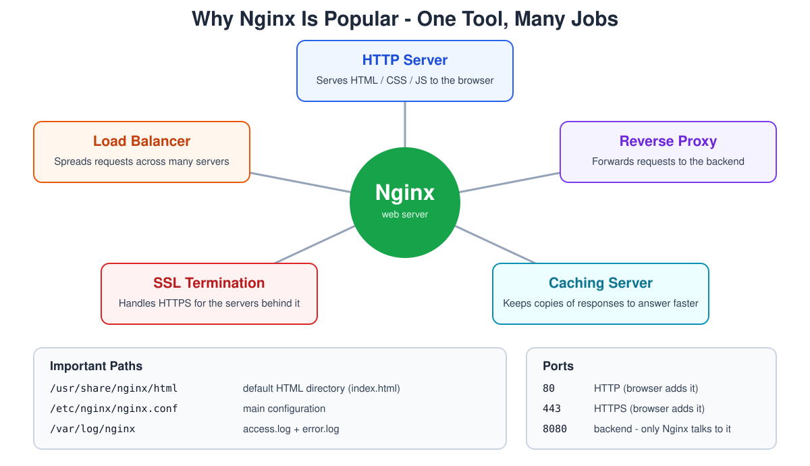
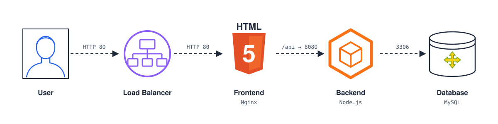
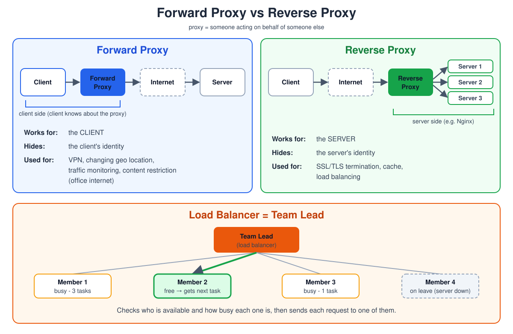
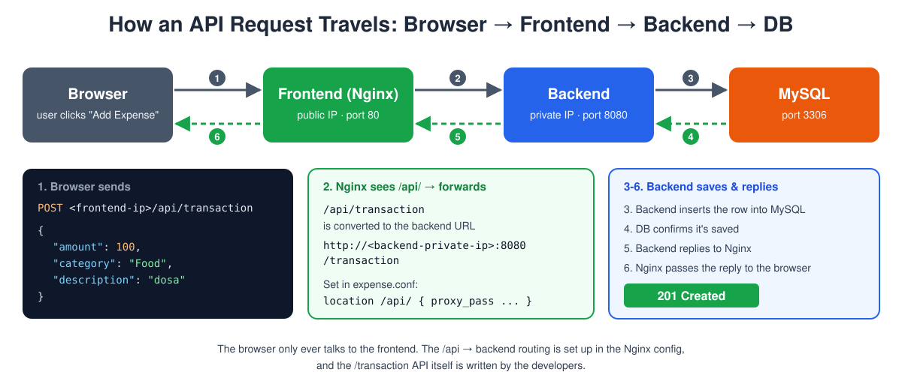
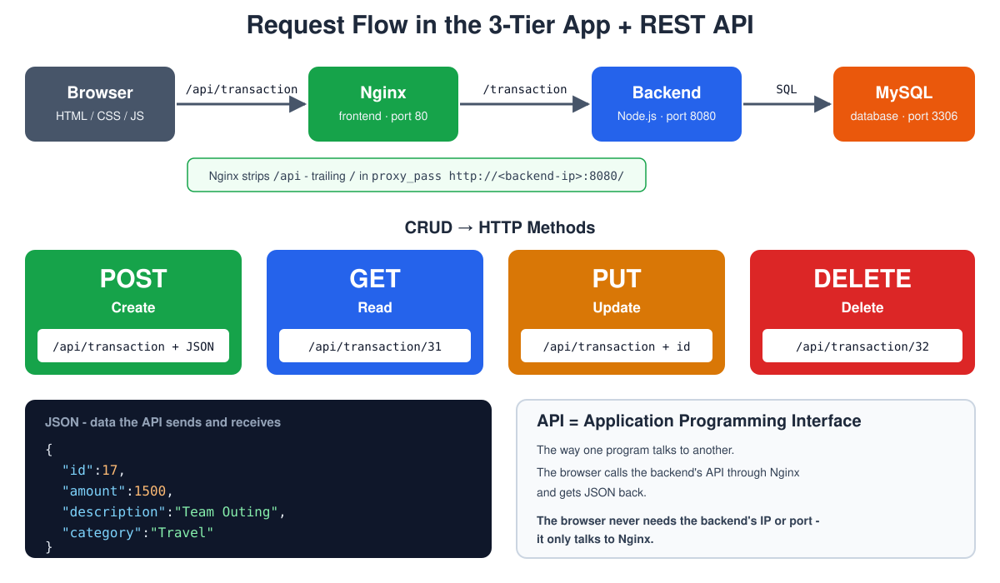
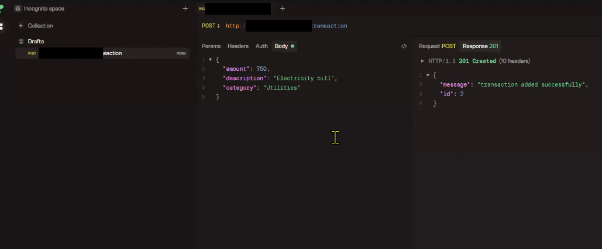
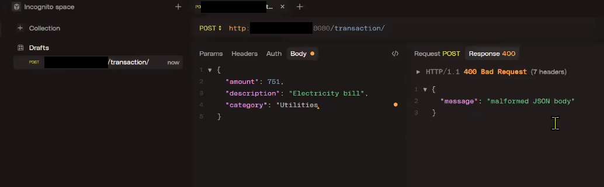
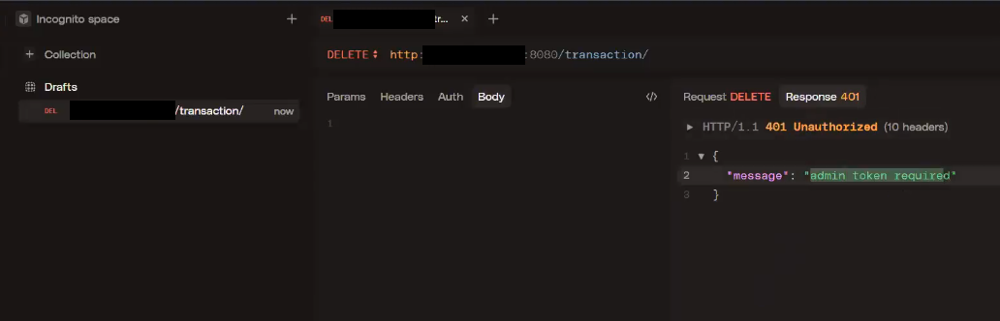
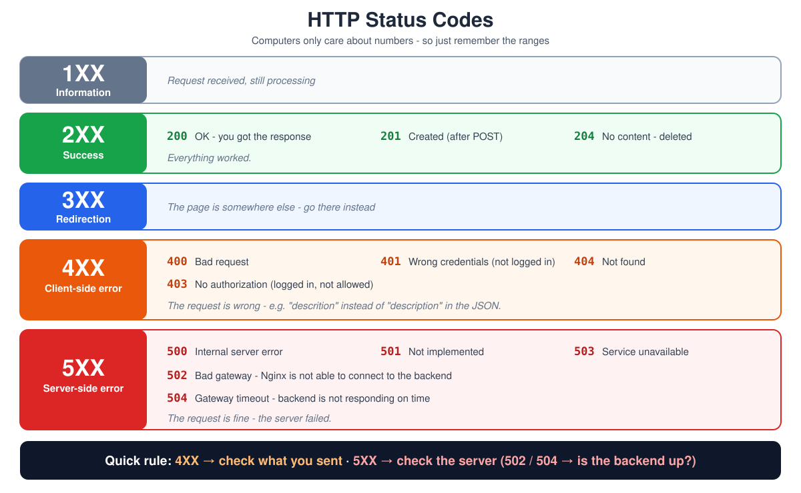
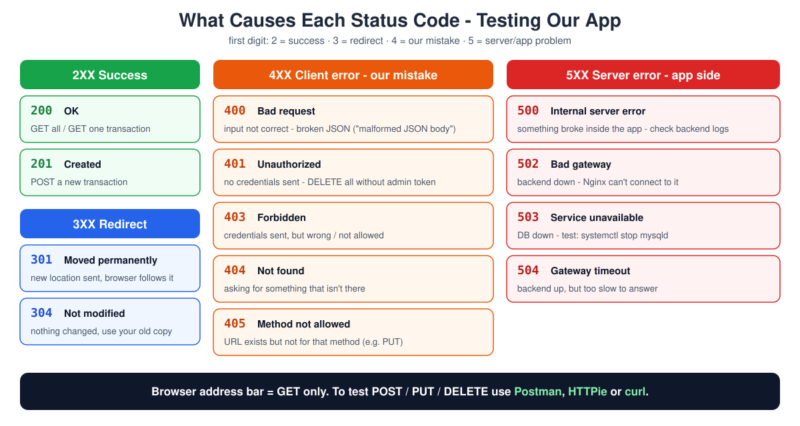

# Day 8 - Nginx, Reverse Proxy, REST API, API Testing & HTTP Status Codes

> **Nginx is popular because one tool can do many jobs:**
> * HTTP server
> * Load balancer
> * Reverse proxy
> * SSL termination
> * Caching server

## Table of Contents

1. [Quick Recap - Deploying the Backend](#quick-recap---deploying-the-backend)
2. [Frontend](#frontend)
3. [Nginx](#nginx)
   - [Why Nginx Is Popular](#why-nginx-is-popular)
   - [Important Paths](#important-paths)
   - [Ports and Domains](#ports-and-domains)
   - [Nginx Logs](#nginx-logs)
4. [Forward Proxy vs Reverse Proxy](#forward-proxy-vs-reverse-proxy)
   - [Where I Got Confused - "It Forwards, So It's a Forward Proxy?"](#where-i-got-confused---it-forwards-so-its-a-forward-proxy)
   - [What a Reverse Proxy Does](#what-a-reverse-proxy-does)
5. [Load Balancing](#load-balancing)
   - [Why We Need a Load Balancer](#why-we-need-a-load-balancer)
   - [Analogy - The Team Lead](#analogy---the-team-lead)
   - [Public LB vs Private (Internal) LB](#public-lb-vs-private-internal-lb)
   - [Forward Proxy vs Reverse Proxy vs Load Balancer](#forward-proxy-vs-reverse-proxy-vs-load-balancer)
6. [Nginx Reverse Proxy Config](#nginx-reverse-proxy-config)
   - [Never Edit the Main File - Use a Separate File](#never-edit-the-main-file---use-a-separate-file)
   - [Our Config File - expense.conf](#our-config-file---expenseconf)
   - [The Main Part - Sending /api/ to the Backend](#the-main-part---sending-api-to-the-backend)
7. [API](#api)
   - [How an API Request Travels](#how-an-api-request-travels)
8. [HTTP Methods (CRUD)](#http-methods-crud)
9. [Testing the Backend API](#testing-the-backend-api)
   - [Health Check](#health-check)
   - [Why Not Just the Browser?](#why-not-just-the-browser)
   - [Backend API Endpoints](#backend-api-endpoints)
   - [Testing with HTTPie / Postman (Screenshots)](#testing-with-httpie--postman-screenshots)
10. [HTTP Status Codes](#http-status-codes)
    - [2XX - Success](#2xx---success)
    - [3XX - Redirection](#3xx---redirection)
    - [4XX - Client-side error](#4xx---client-side-error)
    - [5XX - Server-side error](#5xx---server-side-error)
    - [Test It Yourself: Stop the DB → 503](#test-it-yourself-stop-the-db--503)
    - [504 Gateway Timeout - How Long Nginx Waits](#504-gateway-timeout---how-long-nginx-waits)
11. [Troubleshooting](#troubleshooting)
12. [Summary](#summary)
13. [Interview Questions](#interview-questions)

**Diagrams:** [Why Nginx](images/01-why-nginx-is-popular.svg) · [Forward vs Reverse Proxy](images/02-forward-vs-reverse-proxy.svg) · [Request Flow & REST API](images/03-request-flow-and-rest-api.svg) · [Status Codes](images/04-http-status-codes.svg) · [User → LB → Frontend → Backend → DB](images/05-user-lb-frontend-backend-db.svg) · [API Request Flow](images/06-api-request-flow.svg) · [What Causes Each Status Code](images/07-what-causes-each-status-code.svg)

**More in this folder:** [Troubleshooting step by step](troubleshooting/README.md) · [Interview questions](interview-questions/README.md)

---

## Quick Recap - Deploying the Backend

*Recap from Day 7.* Deploying an app means getting its code onto a server and keeping it running. Whatever the language, the steps are the same - only the commands change.

**The 9 steps (Node.js example):**

1. Install the programming language - `nodejs:24`
2. Create a directory for the application - `/app`
3. Create a system user to run the application - `expense`
4. Download the application as `.tar.gz` into `/tmp`
5. Extract it into `/app`
6. Install dependencies
7. Create the `systemctl` service file
8. Load the schema into the DB
9. Start the application

**Node.js things to remember:**

| Item | What it is |
|------|------------|
| `.js` | Node.js file extension |
| `package.json` | Name, version, description, start scripts, dependencies, etc. |
| `npm` | Node's build / package tool |
| `npm install` | Downloads every dependency listed in `package.json` |
| `package-lock.json` | Locks the **exact** versions of dependencies and sub-dependencies |
| `node_modules/` | Folder where all the dependencies are stored |

Nowadays there's no need for heavy application servers - applications come with **built-in lightweight servers** (Node.js listens on port 8080 by itself).

## Frontend

The frontend is just **HTML, CSS and JS** files. They don't run on the server - the server only hands them to the browser, and the browser runs them. So all we need is a web server that can serve files → **Nginx**.

## Nginx

**Nginx** (pronounced "engine-x") is a web server - software that listens on a port (80/443), receives requests from browsers and sends back a response. It's light, fast and can handle thousands of connections at once.



### Why Nginx Is Popular

Most tools do one job. Nginx can do five, so one install covers many needs - HTTP server, load balancer, reverse proxy, SSL termination and caching server.

#### 1. HTTP Server

We write the website as HTML/CSS/JS files and keep them in Nginx's folder (`/usr/share/nginx/html`). When someone opens our IP or domain in the browser, Nginx (the HTTP server) picks up those files and sends them back - and the browser shows them as the webpage we designed.

**In short:** we keep the files → Nginx serves them → the user sees the webpage.

```text
/usr/share/nginx/html/index.html   →   http://<frontend-ip>/   →   webpage in the browser
```

**Example:** in our expense app, the frontend files are extracted into `/usr/share/nginx/html`, and opening `http://<frontend-ip>/` shows the expense app UI.

#### 2. Load Balancer

When the same app runs on many servers, Nginx receives every request and shares them across the servers, so no single server gets overloaded. If one server goes down, it sends requests to the others.

**Example:** 3 frontend servers behind one Nginx - request 1 → server 1, request 2 → server 2, request 3 → server 3. More in [Load Balancing](#load-balancing).

#### 3. Reverse Proxy

Nginx receives the user's request and **forwards it to another server** behind it (like our backend), then sends the answer back to the user. The user only talks to Nginx and never sees the backend.

**Example:** `http://<frontend-ip>/api/transaction` → Nginx forwards it to `http://<backend-private-ip>:8080/transaction`. More in [Forward Proxy vs Reverse Proxy](#forward-proxy-vs-reverse-proxy).



#### 4. SSL Termination

When we use **HTTPS**, the traffic between the user and our server travels over the internet **encrypted** with an SSL/TLS certificate - nobody in between can read it.

Once that traffic reaches our side, Nginx holds the certificate and **decrypts** it. "Termination" = the encryption **ends** at Nginx. From there, the traffic goes to the servers behind it **unencrypted**, because it's now inside our own private network - it's our internal traffic, so there's no outsider to hide it from.

```text
User ══ HTTPS (encrypted, port 443) ══▶ Nginx ── plain HTTP (8080) ──▶ Backend ── MySQL (3306) ──▶ DB
        over the internet                ↑         inside our private network (not encrypted)
                                    decrypts here
```

- Only Nginx needs the certificate - the backend servers don't have to manage it.
- Encrypting/decrypting takes CPU, so doing it once at Nginx saves the backend that work.

**Example:** user opens `https://mydomain.com` (port 443) → Nginx decrypts → backend gets a normal HTTP request on 8080.

#### 5. Caching Server

Instead of fetching the same files from the backend **every time**, Nginx stores a **copy** of responses (images, CSS, pages that don't change often) in its cache. Next time someone asks for the same thing, Nginx answers straight from the cache - so the response comes **faster**, and the backend gets less load.

**Example:** the logo image is requested 1000 times - the backend sends it once, Nginx serves the other 999 from its cache.

### Important Paths

On Linux, every package puts its files in fixed places. Everything we do with Nginx - changing settings, putting our website, checking errors - happens in one of these paths. Know them and you can set up and troubleshoot Nginx on any server.

| Path | What |
|------|------|
| `/etc/nginx/nginx.conf` | Main (default) Nginx configuration - we read it, we don't edit it |
| `/usr/share/nginx/html/` | Nginx default HTML directory - our website files go here |
| `/usr/share/nginx/html/index.html` | Default HTML page. If you open `http://<frontend-ip>/` and see the Nginx welcome page, **Nginx is installed and running** |
| `/var/log/nginx/` | Nginx logs - `access.log` and `error.log` |
| `/etc/nginx/default.d/expense.conf` | **Our** custom config - the expense reverse proxy (`/api/` → backend). Extra configs go here so the main config isn't disturbed |

```text
/etc/nginx/
├── nginx.conf              ← main config (don't edit)
└── default.d/
    └── expense.conf        ← our custom config (edit here)

/usr/share/nginx/html/      ← website files (index.html ...)

/var/log/nginx/
├── access.log              ← every request
└── error.log               ← errors
```

What's inside the main `nginx.conf`:

- `listen 80;` → which port Nginx listens on
- `root /usr/share/nginx/html;` → which folder the website files are served from
- `log_format` / `access_log` → how and where requests are logged
- `include /etc/nginx/default.d/*.conf;` → loads our extra config files automatically

**Changing the port:** the default port comes from `listen 80;` in the `server` block of `nginx.conf` - that's where you'd look in an interview answer. In practice, following the "don't edit the main file" rule, we'd add our own `server { listen 81; ... }` in a new file under `/etc/nginx/conf.d/` instead of changing `nginx.conf`. Then `nginx -t` and `systemctl restart nginx`.

### Ports and Domains

A **port** is like a door number on the server - one IP can run many apps, each listening on its own port. A **domain** is just an easy name that DNS turns into the IP.

**Examples:**

| URL typed | What actually happens |
|-----------|-----------------------|
| `http://<frontend-ip>/` | Connects to the Linux server on HTTP port **80** - no port typed, so the browser uses 80 by default (same as `http://<frontend-ip>:80/`) |
| `http://mydomain.com` | After the domain is mapped in DNS, the name is converted to the IP → same as `http://<frontend-ip>/` |
| `http://mydomain.com:81` | Connects on port **81**. Works only if Nginx is set to `listen 81;` - and the port **must be typed** in the URL |
| `https://mydomain.com` | Same as `https://mydomain.com:443` - HTTPS default port is **443** |
| backend | Our backend app is reached on port **8080** (only Nginx talks to it, not the internet) |

**Why everyone uses default ports:**

- If you don't mention a port in the URL, the browser takes the **default port** - **80** for `http`, **443** for `https`.
- So clients never need to remember or type port numbers - they just type the domain.
- The port number is written in the **server's config file** (`listen 80;`), not given to users.
- If the server uses a non-default port (like 81), the browser still tries 80 unless you type `:81` - that's why we stick to the defaults.

### Nginx Logs

A **log** is a file where Nginx writes down everything that happens - like a register at a building entrance. When something breaks, logs are the first place to look.

Both logs are in `/var/log/nginx/`:

| File | What's in it |
|------|--------------|
| `access.log` | Every request - who came (IP), when (timestamp), what they asked for, status code, which browser |
| `error.log` | Errors - if something fails, the details are stored here |

```bash
tail -f /var/log/nginx/access.log    # watch requests live
tail -f /var/log/nginx/error.log     # watch errors live (-f = follow, shows new lines as they come)
```

**Where the log format comes from:**

Nginx doesn't decide the log line by itself - the format is defined in the config file `/etc/nginx/nginx.conf`, inside the `http { }` block:

```nginx
http {
    log_format  main  '$remote_addr - $remote_user [$time_local] "$request" '
                      '$status $body_bytes_sent "$http_referer" '
                      '"$http_user_agent" "$http_x_forwarded_for"';

    access_log  /var/log/nginx/access.log  main;
    ...
}
```

- `log_format main '...'` → creates a format named **main**. Each `$variable` is filled in by Nginx for every request.
- `access_log /var/log/nginx/access.log main;` → write every request to `access.log` **using the `main` format**.
- The error log is set separately (outside `http`): `error_log /var/log/nginx/error.log;`
- Want different details in the log? Change `log_format` (or create a new one), then `nginx -t` and `systemctl restart nginx`.

**Reading an access log line (format → real line):**

```text
203.0.113.42 - - [30/Sep/2026:02:24:50 +0000] "GET / HTTP/1.1" 200 9466 "-" "Mozilla/5.0 (Windows NT 10.0; Win64; x64) AppleWebKit/537.36 (KHTML, like Gecko) Chrome/154.0.0.0 Safari/537.36 Edg/154.0.0.0" "-"
```

| Variable in `log_format` | Value in the line | Meaning |
|--------------------------|-------------------|---------|
| `$remote_addr` | `203.0.113.42` | Client IP - where the request came from |
| `-` | `-` | Just a fixed dash written in the format |
| `$remote_user` | `-` | Logged-in user (HTTP basic auth) - none, so `-` |
| `[$time_local]` | `[30/Sep/2026:02:24:50 +0000]` | Timestamp of the request |
| `"$request"` | `"GET / HTTP/1.1"` | Method + path + protocol (asked for the home page) |
| `$status` | `200` | Status code - success |
| `$body_bytes_sent` | `9466` | Response size in bytes |
| `"$http_referer"` | `"-"` | Page the user came from - none, typed directly |
| `"$http_user_agent"` | `"Mozilla/5.0 (Windows NT 10.0 ...) ... Edg/154.0.0.0"` | Browser + OS (here: Microsoft Edge on Windows 10/11) |
| `"$http_x_forwarded_for"` | `"-"` | Real client IP if the request came through another proxy - none here |

> Any value that's empty is written as `-`.

## Forward Proxy vs Reverse Proxy



**Proxy** = someone acting **on behalf of** someone else - a middleman between the client and the server.

- **Forward proxy** sits on the **client's side**. The client sends its request to the proxy, and the proxy goes to the internet for it. The website sees the proxy, not the real client.
- **Reverse proxy** sits on the **server's side**. The client thinks it's talking to the website, but the proxy receives the request and passes it to the real server behind it. The client never sees the real server.

**Analogies:**

- Forward proxy = asking a friend to buy something for you - the shop only sees your friend.
- Reverse proxy = a hotel reception - guests talk to reception, which sends the request to housekeeping, kitchen, etc. Guests never deal with the staff behind it directly.

**Comparison:**

| | Forward Proxy | Reverse Proxy |
|---|---------------|---------------|
| Works for | The **client** (client is aware of it) | The **server** (server is aware of it) |
| Hides | The client's identity | The server's identity |
| Used for | VPN, changing geo location, traffic monitoring and content restriction (office internet) | SSL/TLS termination, cache, load balancing |
| Example | Office proxy / VPN app on your laptop | Nginx in front of our backend |

```text
Forward:  Client → [Forward Proxy] → Internet → Server
Reverse:  Client → Internet → [Reverse Proxy] → Server(s)
```

### Where I Got Confused - "It Forwards, So It's a Forward Proxy?"

While setting up Nginx for the expense app, I paused at this step:

> The browser only talks to the frontend (Nginx). When the app needs data, it calls `/api/...`. We tell Nginx: "any request starting with `/api/` → **forward** it to the backend on port 8080."

**My doubt:** Nginx takes the browser's request and **forwards** it to the backend on our behalf... so isn't that a **forward** proxy? 🤔

**The answer:** every proxy forwards requests. "Forwarding" doesn't decide the type. What decides it is **whose side the proxy is on** and **who it hides**.

**Think like the app owner:**

1. I'm building **my own** app.
2. My concern is to **protect and hide my app servers**.
3. So I put Nginx **in front of my server**.
4. The browser only sees Nginx. It never sees or reaches the backend.
5. Nginx is hiding **my server** → it's a **reverse proxy**. ✅

| | Forward Proxy | Reverse Proxy |
|---|---|---|
| Hides | The **client** from the server | The **servers** from the client (browser / people) |
| Sits in front of | Clients | Servers |
| Who sets it up | User / company network | App owner (me) |

```text
Browser → http://<frontend-ip>/api/transaction
            → Nginx (frontend) → http://<backend-private-ip>:8080/transaction → Backend
          (browser never sees the backend - Nginx hides it)
```

**Rule I remember:**

- Building an app and putting something **in front of my servers** → **reverse proxy** (Nginx, load balancer, AWS ALB, K8s Ingress).
- My machines going **out to the internet** through a company proxy (`http_proxy`) → **forward proxy**.

> **Interview one-liner:** "Forwarding" happens in both. A forward proxy acts for the client and hides the client; a reverse proxy acts for the server and hides the servers. Nginx in front of our backend is a reverse proxy.

### What a Reverse Proxy Does

**Nginx is the most popular reverse proxy server.** A reverse proxy does 5 jobs:

1. **Server aware** - the servers behind it know about the proxy and send all their traffic through it. The client doesn't know the proxy is there - it thinks it's talking to the website directly.
2. **Hides the server's identity** - users and the internet only see the proxy's public IP. The real servers' IPs stay private, so attackers can't reach them directly.
3. **SSL/TLS termination** - traffic is encrypted (HTTPS) over the internet, decrypted at the proxy, and goes plain inside our private network. Details in [SSL Termination](#4-ssl-termination).
4. **Cache** - keeps copies of responses and answers from them, so the next response is faster. Details in [Caching Server](#5-caching-server).
5. **Load balancing** - spreads requests across many servers so none of them gets overloaded. Details in [Load Balancing](#load-balancing).

## Load Balancing

One server can handle only so many requests. When traffic grows, we run **many copies of the same app on many servers**. Now someone has to decide which server gets each request - that's the **load balancer**.

A load balancer:

- Is the **single entry point** - users hit the load balancer, not the servers
- **Spreads requests** across servers so no single server is overloaded
- **Checks health** - if a server is down, it stops sending requests to it
- Makes adding/removing servers easy - users don't notice

```text
              Users
                │
                ▼
        ┌───────────────┐
        │ Load Balancer │   (e.g. Nginx)
        └───────────────┘
         │      │      │
         ▼      ▼      ▼
     Server1 Server2 Server3   ← same app on all
```

The simplest method is **round-robin** - request 1 → server 1, request 2 → server 2, request 3 → server 3, then back to server 1.

### Why We Need a Load Balancer

Without a load balancer, all requests land on the same server(s). During **peak hours** (sale day, salary day, evenings):

- CPU and RAM usage shoots up
- The server starts responding **slowly**
- If it keeps growing, the server can **go down** - and the whole app is down for everyone

With a load balancer, the requests are shared across many servers, so each one stays within its limits, responses stay fast, and if one server fails the others keep serving.

### Analogy - The Team Lead

Think of a team lead (TL):

- Monitors all the members
- Knows how many members are available today
- Knows how much work each member is doing
- Gives the next task to whoever can take it

The load balancer = TL: it checks which servers are healthy and how busy they are, and sends each request to one of them.

A **delivery manager** works the same way one level up - they don't do the work themselves, they look at **what kind of work** it is and send it to the right lead:

```text
                Delivery Manager   ← like Nginx (single entry point)
               /        |        \
         UI Lead   Backend Lead   DB Lead
            |           |            |
        UI team   Backend team    DB team
```

- UI work → UI lead → UI team
- Backend work → Backend lead → Backend team
- DB work → DB lead → DB team

Nginx does the same with requests: it looks at the request and sends it to the right group of servers. In our app:

- `http://<frontend-ip>/` (UI) → served by the frontend (HTML files)
- `http://<frontend-ip>/api/...` (backend work) → sent to the backend servers
- Only the backend talks to the DB

Because each type of work goes straight to the team that handles it, the traffic is distributed and responses are fast.

### Public LB vs Private (Internal) LB

In a real setup there's a load balancer in front of **each tier**:

```text
                 Internet (users)
                       │
                       ▼
            ┌─────────────────────┐
            │  PUBLIC LB          │  ← has a public IP, users can reach it
            └─────────────────────┘
               │               │
           Frontend-1      Frontend-2
               │               │
               ▼               ▼
            ┌─────────────────────┐
            │  PRIVATE (internal) │  ← private IP only, not reachable
            │  LB                 │     from the internet
            └─────────────────────┘
               │               │
           Backend-1       Backend-2
               │               │
               ▼               ▼
                   Database
```

| | Public LB | Private (Internal) LB |
|---|-----------|------------------------|
| Sits in front of | Frontend servers | Backend servers (and DB servers, if there are many) |
| IP | Public IP / domain | Private IP only |
| Who can reach it | Anyone on the internet | Only our own servers (frontend → backend) |
| Why | Users must be able to open the app | Backend and DB must stay hidden from the internet |

**Simple rule:** only the **first** load balancer (before the frontend) is public. Everything behind the frontend is private.

### Forward Proxy vs Reverse Proxy vs Load Balancer

| | Forward Proxy | Reverse Proxy | Load Balancer |
|---|---------------|---------------|---------------|
| Sits on | Client side | Server side | Server side |
| Works for | The client | The server | The servers (as a group) |
| Hides | Client's IP | Server's IP | Server IPs (users see only the LB) |
| Main job | Go to the internet on the client's behalf | Receive requests and forward them to the server behind it | Spread requests across **many** servers |
| Number of servers behind it | - | Can be just one | Always many |
| Examples | VPN, office proxy | Nginx in front of our backend | Nginx `upstream`, AWS ALB |

**How they relate:** a load balancer is a **type of reverse proxy** - every load balancer is a reverse proxy, but a reverse proxy with only one server behind it is not load balancing. Nginx can be both.

## Nginx Reverse Proxy Config

This is how we make our frontend Nginx act as a reverse proxy: any request starting with `/api/` is passed to the backend server, everything else is served from the HTML folder. The extra headers make sure the backend still knows who the real user is.

### Never Edit the Main File - Use a Separate File

Remember how we gave sudo access: instead of editing the main `/etc/sudoers` file, we created a **separate file** in `/etc/sudoers.d/`. We do the **same thing** with Nginx:

| | Main file (don't touch) | Our separate file (edit here) |
|---|-------------------------|-------------------------------|
| sudo | `/etc/sudoers` | `/etc/sudoers.d/<user>` |
| Nginx | `/etc/nginx/nginx.conf` | `/etc/nginx/default.d/expense.conf` |

The main `nginx.conf` already loads every `.conf` file from `/etc/nginx/default.d/` (`include /etc/nginx/default.d/*.conf;`), so our file is picked up automatically.

**Why this is the best approach:**

- The main file's code is **not disturbed** - the default setup keeps working.
- If our config has a mistake, we only fix or delete **our own small file**.
- Everything we added is in one place - easy to see, copy or remove.
- Package updates can replace the main file, but our file stays.

> **Rule:** never edit the default main config files. Always put your changes in a **separate file**.

### Our Config File - `expense.conf`

`/etc/nginx/default.d/expense.conf`:

```nginx
proxy_http_version 1.1;
proxy_set_header Host              $host;
proxy_set_header X-Real-IP         $remote_addr;
proxy_set_header X-Forwarded-For   $proxy_add_x_forwarded_for;
proxy_set_header X-Forwarded-Proto $scheme;
proxy_connect_timeout 5s;
proxy_read_timeout    30s;   # 504 if the backend takes longer than this

# Browser calls /api/transaction → nginx strips /api → backend gets /transaction
location /api/ {
    proxy_pass http://<backend-private-ip>:8080/;
}

location /health {
    stub_status on;
    access_log off;
}

# Status code demos
location = /home {
    return 301 /;            # 301 - moved permanently
}

location = /docs {
    return 302 https://developer.mozilla.org/en-US/docs/Web/HTTP/Reference/Status;   # 302 - temporary redirect
}

location /admin {
    deny all;                # 403 - nobody is allowed here
}
```

| Line | Meaning |
|------|---------|
| `proxy_http_version 1.1` | Talk to the backend using HTTP/1.1 (keeps connections alive) |
| `Host $host` | Pass on the domain/IP the user typed |
| `X-Real-IP $remote_addr` | Pass the real client IP - otherwise the backend only sees Nginx's IP |
| `X-Forwarded-For` | Client IP + every proxy the request passed through |
| `X-Forwarded-Proto $scheme` | Whether the user came on `http` or `https` |
| `proxy_connect_timeout 5s` | Give up if the backend can't be connected within 5s |
| `proxy_read_timeout 30s` | Wait max 30s for the backend's reply, then **504** (see [504 Gateway Timeout](#504-gateway-timeout---how-long-nginx-waits)) |
| `location /api/ { proxy_pass ... }` | **The main part** - see below |
| `location /health` + `stub_status on` | Shows Nginx's own stats (active connections, requests) at `http://<frontend-ip>/health` |
| `access_log off` | Don't fill the log with health-check hits |
| `/home`, `/docs`, `/admin` | Only demos for `301`, `302` and `403` - not needed for the app |

### The Main Part - Sending /api/ to the Backend

In simple words: **anyone requesting a URL that starts with `/api` → Nginx sends that request to the backend server's IP on port 8080.**

```text
User:  http://<frontend-ip>/api/transaction
         │
         ▼
Nginx sees "/api/" → forwards to → http://<backend-private-ip>:8080/transaction → Backend
```

- `location /api/` → "match every request whose path starts with `/api/`".
- `proxy_pass http://<backend-private-ip>:8080/` → "send it to this server". We use the backend's **private IP**, because the backend is not open to the internet - only Nginx can reach it.
- The trailing `/` in `proxy_pass` strips `/api` → `/api/transaction` reaches the backend as `/transaction`.
- Any other request (`/`, `/index.html`, css, js) does **not** match, so Nginx serves it from `/usr/share/nginx/html/` as usual.

After editing, always:

```bash
nginx -t                    # check config syntax
systemctl restart nginx     # apply the change
```

## API

**API = Application Programming Interface** - the way one program talks to another. Here the frontend (browser) talks to the backend through the API, and the data comes back as **JSON**.

**Analogy:** a waiter in a restaurant - you (frontend) don't go into the kitchen (backend); you give your order to the waiter (API), and the waiter brings back the food (JSON response).

**Example:** `GET http://<frontend-ip>/api/transaction`:

```json
{
    "result": [
        { "id": 26, "amount": 1000, "description": "food", "category": "Food" },
        { "id": 25, "amount": 500, "description": "shopping in mall", "category": "Shopping" },
        { "id": 20, "amount": 7000, "description": "Malaysia", "category": "Travel" },
        { "id": 17, "amount": 1500, "description": "Team Outing", "category": "Travel" }
    ]
}
```

### How an API Request Travels



When we add an expense in the app, the browser sends the request to the **frontend** - never directly to the backend:

```text
Browser → http://<frontend-ip>/api/transaction
Method: POST
Body:   {"amount": 100, "category": "Food", "description": "dosa"}
Response → 201 Created
```

What happens behind the scenes:

1. The request reaches **Nginx** on the frontend.
2. The path starts with `/api`, so Nginx **forwards** it to the backend. `/api/transaction` is converted to the backend URL:
   ```text
   http://<backend-private-ip>:8080/transaction
   ```
3. The **backend** takes the data and saves it in the **DB**.
4. The backend sends the response back → Nginx → browser (`201 Created`).

So one request passes through **one server to another**: browser → frontend → backend → DB, and the answer comes back the same way.

- The `/api` → backend forwarding is our **Nginx config** (`location /api/ { proxy_pass ... }` in `expense.conf`).
- The API URLs (`/transaction`, `/health`) and what they return are **written by the developers**.
- That's how the app can show everything together: the **frontend** gives the look (layout, colours), and the **data** comes from the DB through the backend.

## HTTP Methods (CRUD)

An **HTTP method** tells the server **what action** you want on the data. Almost every app only does four things with data - **CRUD** = Create, Read, Update, Delete - and each maps to a method.

The **URLs** (like `/api/transaction`) and which methods they accept are **created by the developers** when they build the backend. We just call them.

| CRUD | Method | In simple words |
|------|--------|-----------------|
| **C**reate | `POST` | Send new data → it gets saved in the DB |
| **R**ead | `GET` | Get data from the DB and read it |
| **U**pdate | `PUT` | Change data that's already in the DB |
| **D**elete | `DELETE` | Remove data from the DB |



### GET - read data

```text
URL:    http://<frontend-ip>/api/transaction        → reads ALL transactions
URL:    http://<frontend-ip>/api/transaction/31     → reads ONLY transaction 31
Method: GET
```

- With a number at the end (`/31`) → only that one record.
- Without a number → all the records.
- `GET` only reads - it never changes anything in the DB.

### POST - create data

```text
URL:    http://<frontend-ip>/api/transaction
Method: POST
Body:   {"amount": 200, "category": "Entertainment", "description": "movie"}
```

We **post** (send) the new data in the body → the backend saves it in the DB as a new transaction. No `id` in the body - the DB gives it a new `id`.

### PUT - update data

```text
URL:    http://<frontend-ip>/api/transaction
Method: PUT
```

```json
{
    "id": 17,
    "amount": 1500,
    "description": "Team Outing",
    "category": "Entertainment"
}
```

The `id` tells **which** record to change (transaction 17) → its details are replaced with what we sent (here the category becomes `Entertainment`).

### DELETE - delete data

```text
URL:    http://<frontend-ip>/api/transaction/32
Method: DELETE
```

Deletes transaction number **32** from the DB.

### Try them with `curl`

Through the **frontend** (the normal way - with `/api`, no port):

```bash
curl http://<frontend-ip>/api/transaction                          # GET all
curl http://<frontend-ip>/api/transaction/31                       # GET one
curl -X POST http://<frontend-ip>/api/transaction \
     -H "Content-Type: application/json" \
     -d '{"amount": 200, "category": "Entertainment", "description": "movie"}'
curl -X DELETE http://<frontend-ip>/api/transaction/32              # DELETE
```

## Testing the Backend API

### Health Check

The quickest test - is the backend running and can it reach the DB?

```bash
curl http://<backend-ip>:8080/health
```

```json
{"status":"ok","db":"up"}
```

`status: ok` means the backend is working. `db: up` means it can talk to MySQL.

> To call the backend directly from your laptop, port **8080** must be allowed in the backend's security group. Allow it only from **My IP**, only while testing, and remove it after - normally only the frontend should reach 8080. From the frontend server you can always test with its **private** IP.

### Why Not Just the Browser?

When you type a URL in the browser's address bar, the browser always sends a **GET**. So from the browser we can only **get** (read) information - we can't **post**, update or delete.

To test all methods, we use **API testing tools**:

| Tool | Type |
|------|------|
| **Postman** | Desktop/web app - most popular |
| **HTTPie** | Web/desktop app + command line |
| **curl** | Command line, already on every Linux server |

In these tools we choose the **method**, type the **URL**, add the **JSON body**, click Send, and see the **status code** and **response**.

### Backend API Endpoints

**Which URL to use:**

| Sending the request to | URL |
|------------------------|-----|
| **Frontend** (normal way, through Nginx) | `http://<frontend-ip>/api/transaction` |
| **Backend** directly (testing) | `http://<backend-ip>:8080/transaction` |

Frontend → add `/api`, no port (80 by default). Backend → no `/api`, add port `:8080`.

Calling the backend directly:

| Method | URL | What it does |
|--------|-----|--------------|
| `GET` | `http://<backend-ip>:8080/transaction` | Get **all** transactions |
| `GET` | `http://<backend-ip>:8080/transaction/2` | Get the transaction with **ID 2** |
| `POST` | `http://<backend-ip>:8080/transaction` | Add a new transaction (JSON body below) |
| `DELETE` | `http://<backend-ip>:8080/transaction/4` | Delete transaction **4** |
| `DELETE` | `http://<backend-ip>:8080/transaction/` | Delete **all** transactions (needs an admin token) |
| `GET` | `http://<backend-ip>:8080/health` | Health check |

`POST` body:

```json
{
  "amount": 750,
  "description": "Electricity bill",
  "category": "Utilities"
}
```

Same with `curl`, straight to the **backend** (no `/api`, port `8080`):

```bash
curl http://<backend-ip>:8080/transaction                     # GET all
curl http://<backend-ip>:8080/transaction/2                   # GET one
curl -X POST http://<backend-ip>:8080/transaction \
     -H "Content-Type: application/json" \
     -d '{"amount": 750, "description": "Electricity bill", "category": "Utilities"}'
curl -X DELETE http://<backend-ip>:8080/transaction/4         # DELETE one
```

### Testing with HTTPie / Postman (Screenshots)

**1. POST a new transaction → `201 Created`** - the backend saved it and gave it `id: 2`.



**2. GET all transactions → `200 OK`** - the new one (`id: 2`) is now in the list.


**3. POST with broken JSON → `400 Bad Request`** - the closing `"` after `Utilities` is missing, so the input is not correct (`malformed JSON body`). Our mistake → 4XX.



**4. DELETE all without a token → `401 Unauthorized`** - deleting everything is an admin action, and we didn't send any credentials (`admin token required`).



## HTTP Status Codes



A **status code** is a 3-digit number the server sends back with every response to say **what happened**. Computers only care about numbers, humans can't remember them all - so we just learn the ranges.

- The codes themselves are **standard** (same meaning everywhere). The **developers** decide which code their app sends back in each situation.
- By looking at the code, we can tell if our request **succeeded or failed** - and if it failed, **whose side** the problem is on.

| Starts with | Meaning | Whose side |
|-------------|---------|------------|
| **1XX** | Information | - |
| **2XX** | Success | Everything worked |
| **3XX** | Redirection | Go to another URL |
| **4XX** | Client-side error | **Our** mistake (the request) |
| **5XX** | Server-side error | The **application/server's** problem |



### 2XX - Success

If the code starts with **2**, the request worked.

| Code | Meaning | When |
|------|---------|------|
| `200` | OK - you got the response | `GET` worked |
| `201` | Created | `POST` saved new data |
| `204` | No content | `DELETE` worked - info deleted, nothing to send back |

### 3XX - Redirection

| Code | Meaning | In simple words |
|------|---------|-----------------|
| `301` | Moved permanently | The page has a new location - it's sent in the response and the browser goes there automatically |
| `302` | Found (temporary redirect) | Go to another page **for now** - e.g. our `/docs` → MDN status codes page |
| `304` | Not modified | Nothing changed since last time - use your old (cached) response |

A 3XX code is **not an error**. It means "**something has changed**, go here instead". The server sends the new location, and the browser (or tool) goes there automatically.

**Example 1 - developers renamed the API (`301`):**

```text
Old: GET /transactions   (with "s")
New: GET /transaction
```

The developers changed the name recently. If someone still calls the old `/transactions`, they get **`301 Moved Permanently`** with the new location, and land on `/transaction`. Old links keep working.

**Example 2 - a page that moved (`301`):**

```text
http://mydomain.com/home  →  301  →  http://mydomain.com/
```

Users don't need to remember the exact page. Even if they type `/home`, they're redirected to the correct page. We set this up in `expense.conf`:

```nginx
location = /home {
    return 301 /;
}
```

**`304 Not Modified`** - also a 3XX, but no new location. The browser asks "has this changed since I last downloaded it?" The server says "no, **not modified**", so the browser shows its **cached** copy. It's faster, and nothing is downloaded again.

### 4XX - Client-side error

If the code starts with **4**, it's **our mistake** - we asked for something wrong, something that isn't there, or something we're not allowed to see.

| Code | Meaning | In simple words |
|------|---------|-----------------|
| `400` | Bad request | Input is not correct - bad/missing data, broken JSON |
| `401` | Unauthorized | **No credentials** sent / not logged in (e.g. DELETE all without the admin token) |
| `403` | Forbidden | Credentials sent, but **wrong / no access** - not authorised for this |
| `404` | Not found | Asking for data/page that isn't there (e.g. `/api/transaction/9999`) |
| `405` | Method not allowed | The URL exists, but not for that method (e.g. `PUT` when the API doesn't support it) |

> **401 vs 403:** 401 = "who are you?" (no credentials). 403 = "I know who you are, but you're not allowed".

**Example** - a typo in the key (`descrition` instead of `description`):

```json
{
    "id": 17,
    "amount": 1500,
    "descrition": "Team Outing",
    "category": "Entertainment"
}
```

The backend doesn't get the `description` field it expects. That's **our** mistake, so the answer is a **4XX** (e.g. `400 Bad Request`), not 5XX.

### 5XX - Server-side error

If the code starts with **5**, our request was fine - the problem is on the **application/server side**.

| Code | Meaning | In simple words | Commands to check |
|------|---------|-----------------|-------------------|
| `500` | Internal server error | Something broke inside the application - the code doesn't say what. Check the backend logs | Backend: `journalctl -u backend -n 50`, `tail -f /var/log/nginx/error.log` |
| `501` | Not implemented | The server doesn't support this feature yet - rarely seen | Check the API supports that method/URL: `curl -i -X <method> http://localhost:8080/api/...` |
| `502` | Bad gateway | **Backend down** - the frontend (Nginx) can't connect to the backend / didn't get a proper response from it | Backend: `systemctl status backend`, `netstat -lntp \| grep 8080`, `journalctl -u backend -n 50` |
| `503` | Service unavailable | The service can't work right now - e.g. **DB down** | Backend: `curl localhost:8080/health`. DB: `systemctl status mysqld`, `netstat -lntp \| grep 3306`, `telnet <mysql-private-ip> 3306` |
| `504` | Gateway timeout | The backend is up but didn't answer in time | Frontend: `curl http://<backend-private-ip>:8080/health`, `grep proxy_pass /etc/nginx/default.d/expense.conf`. AWS: **backend SG 8080** |

> **Quick rule:** 2XX → success. 3XX → redirect, not an error. 4XX → check what **you** sent. 5XX → check the **server** (502/504 → is the backend up and reachable?). Full steps → [troubleshooting/](troubleshooting/README.md#502-vs-503-vs-504-what-to-check)

### Test It Yourself: Stop the DB → 503

On the **DB server**, stop MySQL:

```bash
systemctl stop mysqld
```

Now open the app or call the API:

```bash
curl -i http://<backend-ip>:8080/health      # -i shows the status code too
```

You get **`503 Service Unavailable`** - the backend is running, but the DB behind it is down, so it can't serve the request. Start MySQL again and it works:

```bash
systemctl start mysqld
```

Same idea for 502: stop the **backend** (`systemctl stop backend`) and open the app → Nginx can't reach the backend → **`502 Bad Gateway`**.

### 504 Gateway Timeout - How Long Nginx Waits

```text
frontend (Nginx) → backend → database
```

When Nginx forwards a request to the backend, it **waits** for the answer - but only up to a time limit. If the backend doesn't reply within that time, Nginx stops waiting and sends the user **`504 Gateway Timeout`**.

The time limit is set in the Nginx config:

| Setting | What it limits | Nginx default | Our `expense.conf` |
|---------|----------------|---------------|--------------------|
| `proxy_connect_timeout` | Time to **connect** to the backend | 60s | `5s` |
| `proxy_read_timeout` | Time to wait for the backend's **reply** | 60s | `30s` |

```nginx
proxy_connect_timeout 5s;
proxy_read_timeout    30s;   # 504 if the backend takes longer than this
```

So in our setup:

- Backend answers within **30 seconds** → user gets the normal response (`200`, `201` ...).
- Backend is up but takes **more than 30 seconds** (slow DB query, stuck code) → Nginx gives up → **`504 Gateway Timeout`**.
- If we didn't set `proxy_read_timeout`, Nginx would wait the default **60 seconds** before giving the 504.

**Why not wait forever?** The user would just see a loading page, and every waiting request keeps a connection open on the frontend. It's better to fail fast with a clear error.

> **502 vs 504:** 502 = Nginx **can't connect** to the backend at all (backend down / port closed). 504 = Nginx **connected**, but the backend **didn't answer in time**.

## Troubleshooting

When you get errors, **check the logs first**, step by step: Nginx `access.log` → `journalctl -u backend` → `systemctl status` / `ps -ef` / `netstat -lntp` → `curl http://localhost:8080/health`. Full approach and a real example (500 → `Access denied for user 'expense'` → fix DB credentials → `daemon-reload` + `restart`) in [troubleshooting/README.md](troubleshooting/README.md).

## Summary

- Nginx = HTTP server + load balancer + reverse proxy + SSL termination + cache.
- Web files live in `/usr/share/nginx/html`, config in `/etc/nginx/nginx.conf`, logs in `/var/log/nginx`.
- Forward proxy works for the client and hides it; reverse proxy works for the server and hides it.
- Reverse proxy jobs: server aware, hides server IP, SSL termination (encrypted outside, plain inside), cache, load balancing.
- Load balancer spreads requests so servers don't get overloaded at peak hours; public LB before the frontend, private LB before backend/DB.
- `location /api/` + `proxy_pass` sends API calls to the backend on 8080; `X-Forwarded-*` headers keep the real client details.
- REST API: `GET` read, `POST` create, `PUT` update, `DELETE` delete; data travels as JSON.
- API flow: browser → frontend `/api/transaction` → Nginx forwards to `backend:8080/transaction` → DB, and the response comes back the same way.
- Browser address bar = GET only. Use Postman / HTTPie / curl to test POST, PUT and DELETE. Frontend URL: `<frontend-ip>/api/transaction`; backend URL: `<backend-ip>:8080/transaction`; `/health` → `{"status":"ok","db":"up"}`.
- Status codes: 2XX success, 3XX redirect (not an error - 301 new location, 304 use cache), 4XX our mistake (400, 401, 403, 404, 405), 5XX server side (500, 502 backend down, 503 DB down, 504 too slow - Nginx waits 60s by default, 30s in our config).
- Troubleshoot from the logs: Nginx `access.log` → `journalctl -u backend` → status/ps/netstat → `/health`.

## Interview Questions

Quick revision questions for this day are in [interview-questions/README.md](interview-questions/README.md).
