# Day 8 - Hands-On: Rebuilding the Expense App (and Two DB Bugs)

[← Back to Day 8 notes](../README.md)

My second full run of the 3-tier expense app on fresh EC2 servers, before the DNS setup in Day 9. I hit two DB problems on the way. Both are explained step by step below, with how I found and fixed them.

> Passwords and the admin token are blacked out in the screenshots.

## Contents

1. [The Servers](#1-the-servers)
2. [Frontend (Nginx)](#2-frontend-nginx)
3. [Backend (Node.js)](#3-backend-nodejs)
4. [Problem 1 - "db":"down" Because I Set Up in the Wrong Order](#4-problem-1---dbdown-because-i-set-up-in-the-wrong-order)
5. [Database (MySQL)](#5-database-mysql)
6. [Problem 2 - root@localhost Had an Empty Password](#6-problem-2---rootlocalhost-had-an-empty-password)
7. [App in the Browser + Data in the DB](#7-app-in-the-browser--data-in-the-db)
8. [Lessons](#8-lessons)

---

## 1. The Servers

3 EC2 servers, same as Day 7:

| Server | Hostname | Security group | Inbound |
|---|---|---|---|
| DB | `mysqldb` | `mysql-sg` | 3306 from `backend-sg` |
| Backend | `backend` | `backend-sg` | 8080 from `frontend-sg` |
| Frontend | `frontend` | `frontend-sg` | 80 from internet |

- **AMI:** `Redhat-9-DevOps-Practice`, t3.micro, us-east-1
- **Login:** `ssh ec2-user@<public-ip>` → `sudo su -` (no key pair, the AMI uses a password)
- **Names:** `hostnamectl set-hostname <name>` → `exec bash` so the prompt shows `root@backend`, not an IP

> I set them up **frontend → backend → DB**. That was the mistake - see [Problem 1](#4-problem-1---dbdown-because-i-set-up-in-the-wrong-order). The right order is **DB → backend → frontend**.

---

## 2. Frontend (Nginx)

**Install Nginx, start it, clear the default page, download and extract the frontend:**

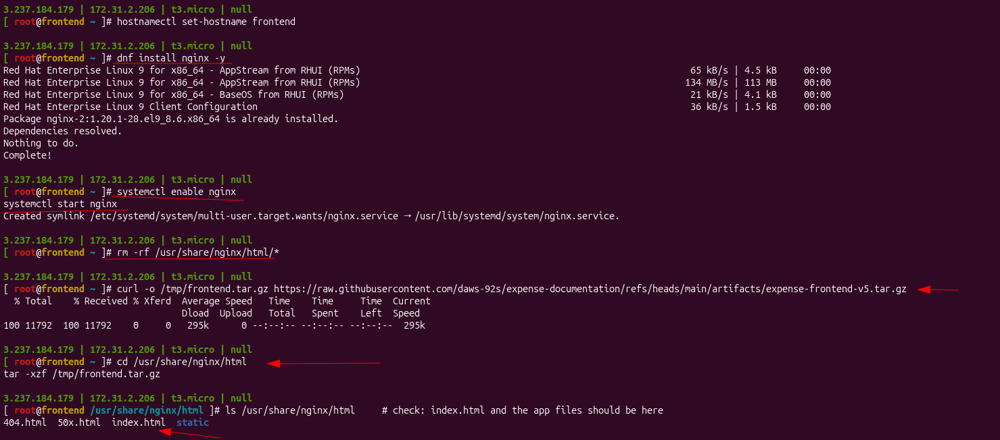

`ls /usr/share/nginx/html` → `index.html`, `404.html`, `50x.html`, `static` = files are in place ✅

**Reverse proxy config** - `/etc/nginx/default.d/expense.conf`, with the backend **private IP** in `proxy_pass`:

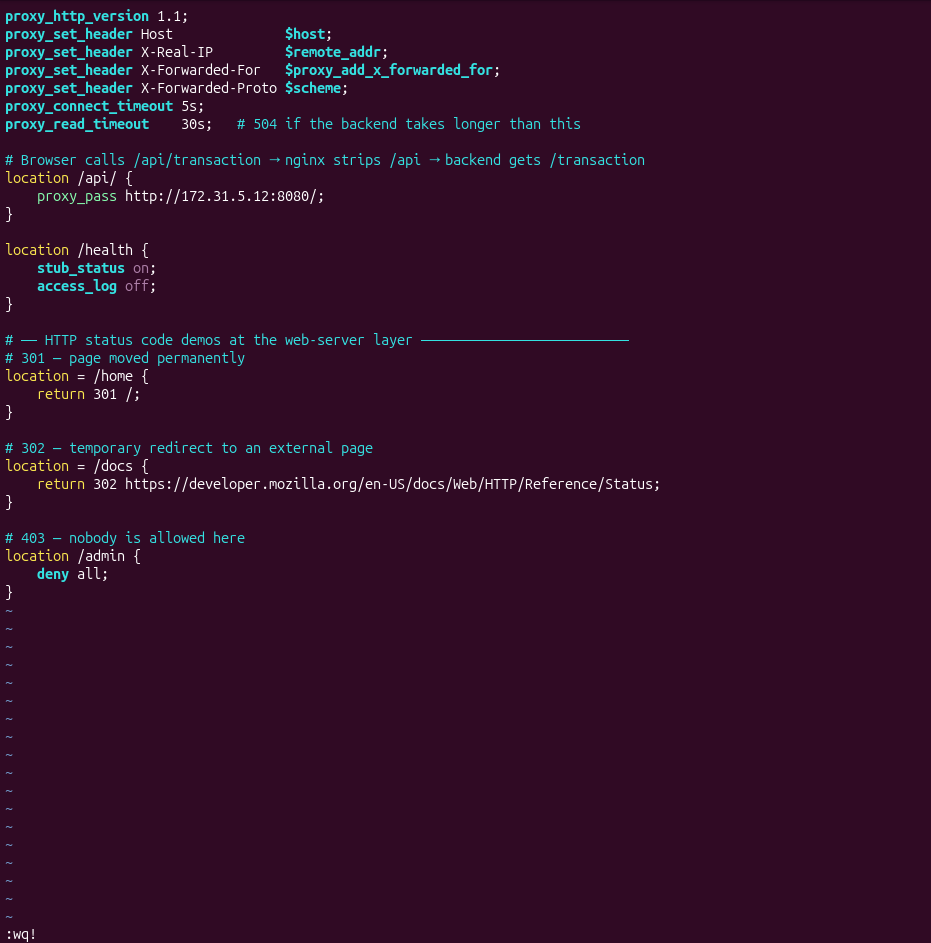

**Test the config, then restart:**

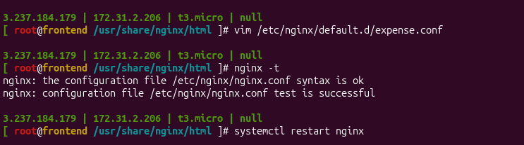

At this point `curl http://localhost/api/health` gave a **5XX** page - normal, the backend didn't exist yet.

---

## 3. Backend (Node.js)

**Install Node.js 24:**

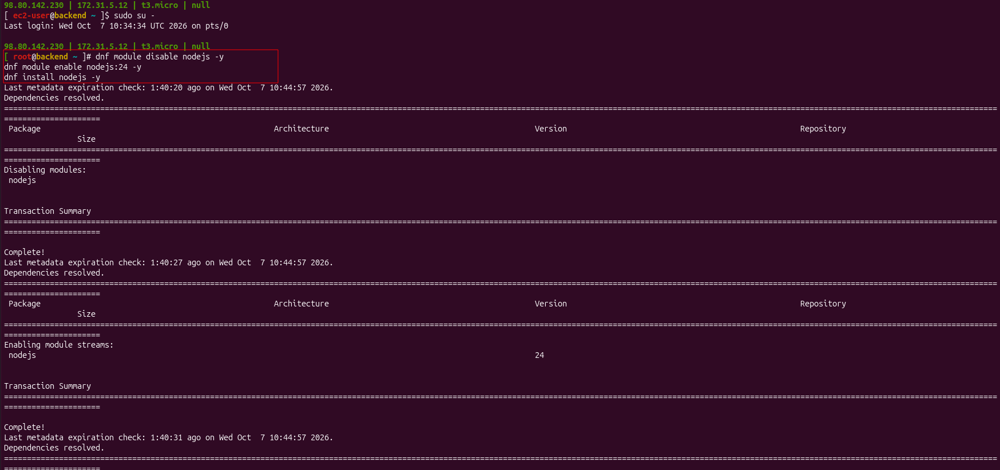

Then (same as Day 7): `mkdir /app` → `useradd ... expense` → download + extract code → `npm install`.

**Service file** - `DB_HOST` = DB **private IP**:

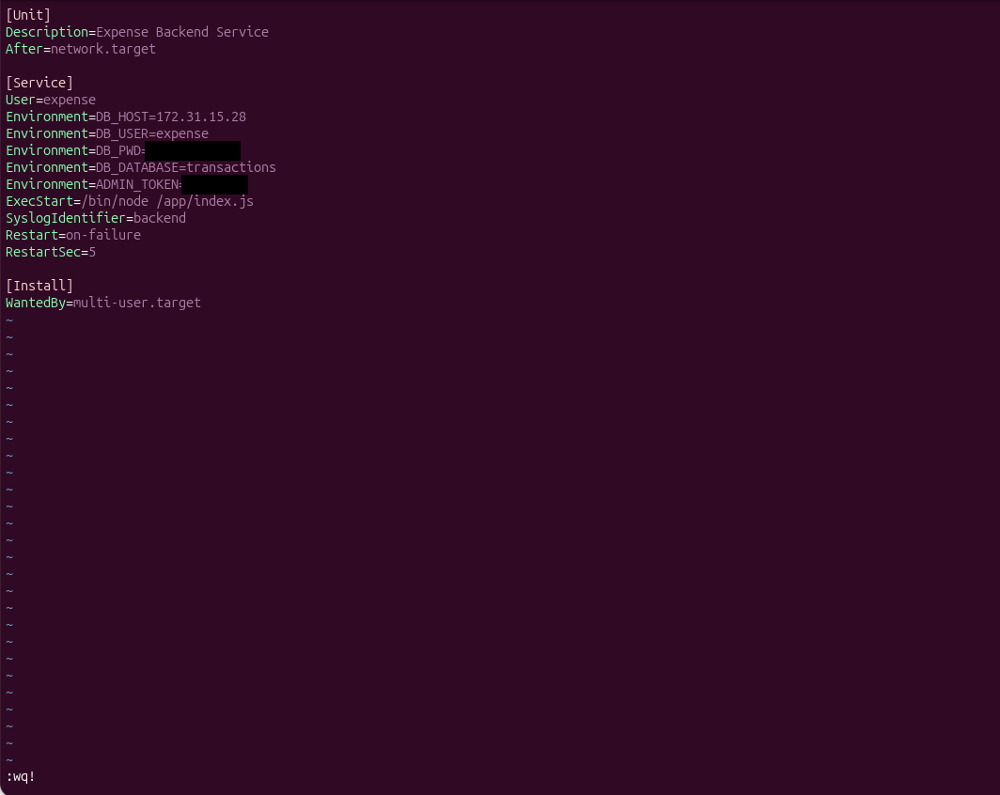

`DB_USER` / `DB_PWD` are the **app's** DB login (`expense`) - only a copy. The real password lives in MySQL on the DB server.

---

## 4. Problem 1 - "db":"down" Because I Set Up in the Wrong Order

**What happened:**

1. I loaded the schema on the backend **before** the DB server was set up:
   ```bash
   mysql -h <db-private-ip> -u root -p<db-root-password> < /app/schema/backend.sql
   # ERROR 2003 (HY000): Can't connect to MySQL server on '<db-private-ip>:3306' (111)
   ```
2. The backend started fine (`listening on port 8080`), but the health check said:
   ```text
   {"status":"degraded","db":"down","error":"Access denied for user 'expense'@'ip-...' (using password: YES)"}
   ```

**Why:** the schema file is what **creates** the `expense` user in MySQL. It never ran, so the user didn't exist.

**How I fixed it** - after setting up the DB, I came back to the backend and ran the schema load again:

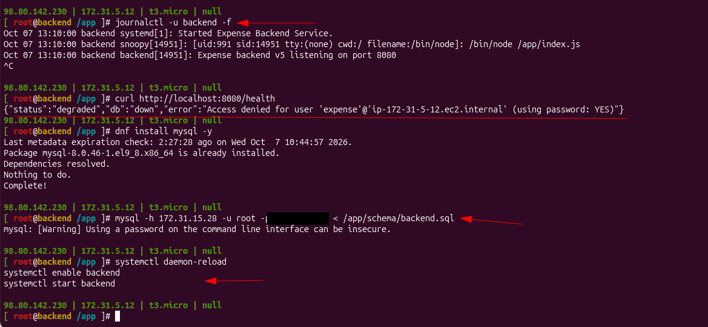

Only the "password on the command line" warning = success. Then restart and check:

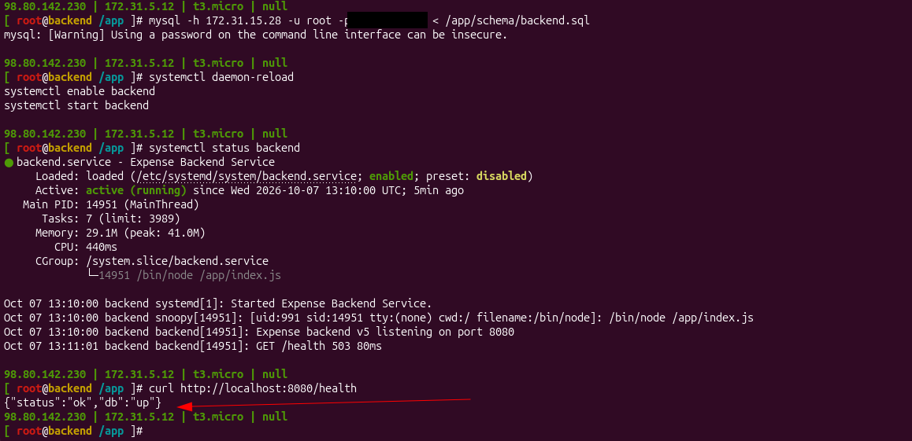

`{"status":"ok","db":"up"}` ✅ - and `curl http://localhost/api/health` on the frontend gave the same.

> **Remember:** the schema load runs **on the backend** but writes **into the DB**. The DB must be running with its root password set first. Full mental model with a diagram: [Day 7 - Build in Reverse of the Request Flow](../../day-07-3tier-nodejs-expense-app/README.md#mental-model---build-in-reverse-of-the-request-flow).

---

## 5. Database (MySQL)

**Install MySQL server:**

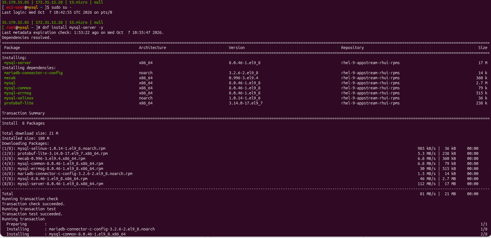

Then:

```bash
systemctl enable mysqld
systemctl start mysqld
mysql_secure_installation --set-root-pass <db-root-password>
```

The last command **printed nothing**. I assumed it worked - it didn't fully. See Problem 2.

---

## 6. Problem 2 - root@localhost Had an Empty Password

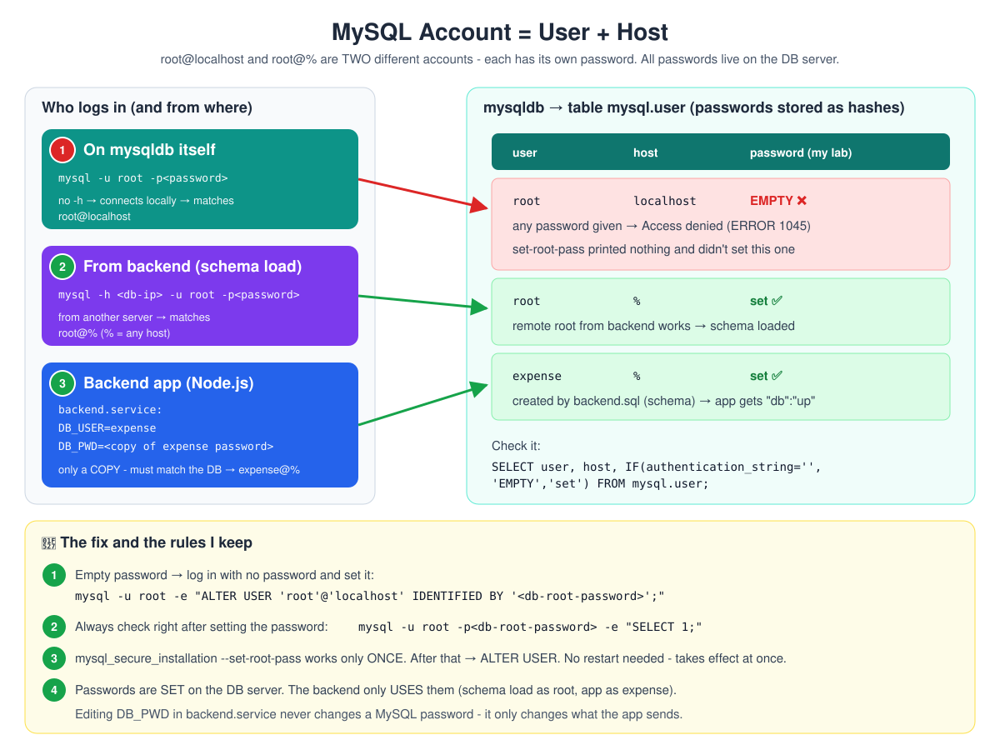

**What I saw:**

| Where | Command | Result |
|---|---|---|
| Backend | `mysql -h <db-private-ip> -u root -p<db-root-password>` | ✅ `mysql>` - works |
| DB server | `mysql -u root -p<db-root-password>` | ❌ `ERROR 1045 Access denied for user 'root'@'localhost'` |
| DB server | `mysql_secure_installation --set-root-pass <db-root-password>` again | `Password already set, You cannot reset the password with mysql_secure_installation` |

Same user, same password - works from the backend, fails on the DB server. Why?

**How I found it, step by step:**

1. `history | grep set-root-pass` → I had typed the right password both times. So no typo.
2. `mysql -u root -e "SELECT 1;"` (**no** password) → it worked! So root on the DB server had **no password**.
3. Checked both root accounts:

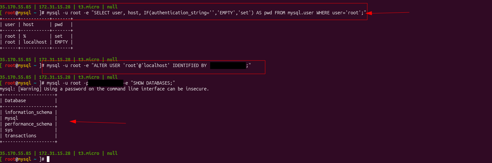

| user | host | password |
|---|---|---|
| root | `%` | set ✅ - used from the backend |
| root | `localhost` | **EMPTY** ❌ - used on the DB server itself |

**Why:** in MySQL an account is **user + host**. `root@localhost` and `root@%` are two separate accounts with separate passwords. `set-root-pass` only set `root@%` on my server, and printed nothing. An account with **no** password rejects **any** password you give it → Access denied.

**The fix** - log in with no password and set it (no restart needed, it works at once):

```bash
mysql -u root -e "ALTER USER 'root'@'localhost' IDENTIFIED BY '<db-root-password>';"
mysql -u root -p<db-root-password> -e "SHOW DATABASES;"     # transactions is listed ✅
```

> **Why it "worked for others":** the app never logs in as `root@localhost` (schema load uses `root@%`, the app uses `expense`). So you only notice this if you log in on the DB server itself - like I did during verification.

---

## 7. App in the Browser + Data in the DB

Open `http://<frontend-public-ip>` - the frontend is the only server with port 80 open to the internet.

**Empty app:**

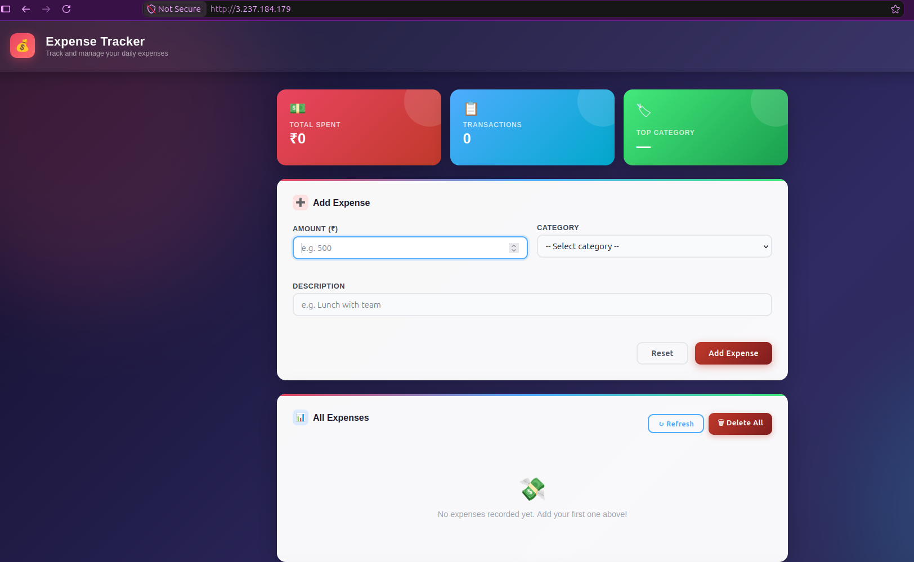

**Added 2 expenses** → `201 Created`:

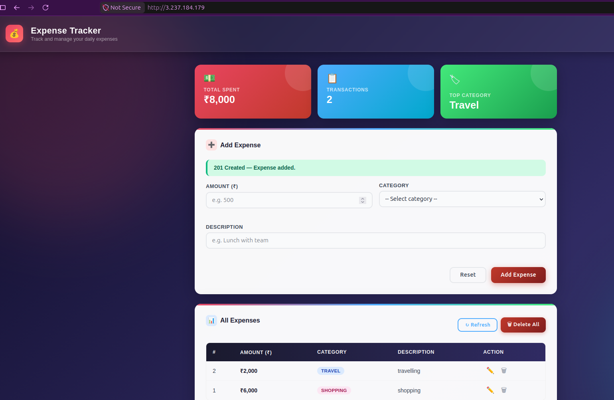

**Same rows in MySQL** on the DB server:

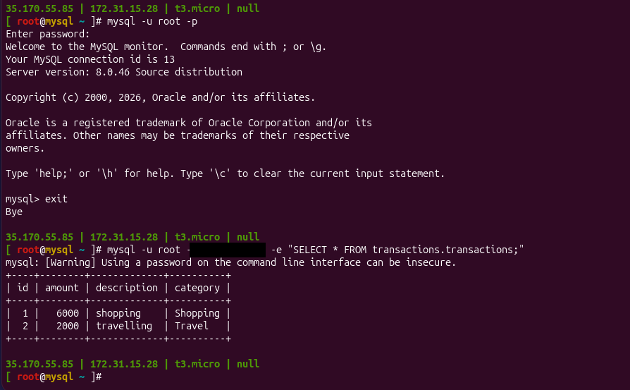

Full flow proven: **browser → Nginx (frontend) → Node.js (backend) → MySQL (DB)** ✅

---

## 8. Lessons

1. **Build DB → backend → frontend** - the reverse of the request flow. Each tier needs the one below it.
2. **Load the schema only after the DB is ready** (`mysqld` running + root password set). It runs on the backend but creates the DB, table and `expense` user **in** the DB.
3. **Check right after setting the password:** `mysql -u root -p<db-root-password> -e "SELECT 1;"`. A command that prints nothing hasn't proven anything.
4. **MySQL account = user + host.** `root@localhost` ≠ `root@%`. Check with `SELECT user, host FROM mysql.user;`.
5. **`set-root-pass` works only once.** After that, change passwords with `ALTER USER` - takes effect immediately, no restart.
6. **Passwords are SET on the DB server.** The backend only **uses** them. Editing `DB_PWD` in `backend.service` never changes a MySQL password.
7. **Read the error word by word:** `Access denied for user 'expense'` = schema not loaded. `Access denied for user 'root'@'localhost'` = local root password wrong/empty. `(111)` = MySQL not listening. `(110)` = blocked/timeout.

More detail: [Troubleshooting - Example: Schema Loaded Before the DB Was Ready](../troubleshooting/README.md#example-schema-loaded-before-the-db-was-ready) and [Example: root@localhost Has an Empty Password](../troubleshooting/README.md#example-rootlocalhost-has-an-empty-password).
