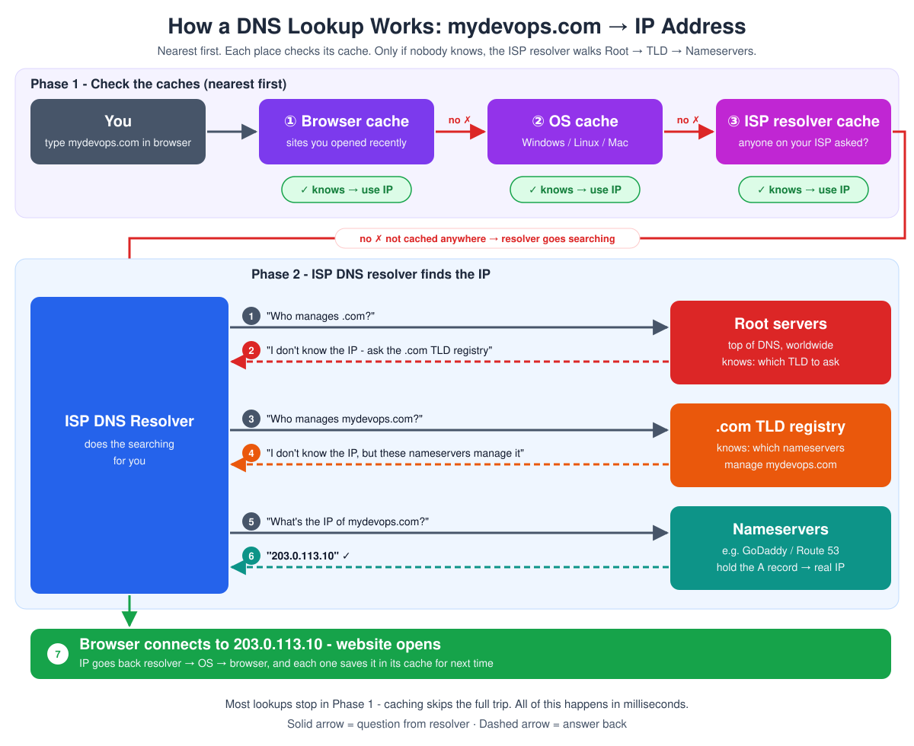

# Day 9 - DNS (Domain Name System): How Domain Names Actually Work

> **DNS in short:** DNS converts a domain name into an IP address. We type `facebook.com`, DNS finds its IP (`104.104.56.87`), and the browser connects to that IP. It's like the phone contacts list of the internet.

## Table of Contents

1. [What this is / why it matters](#what-this-is--why-it-matters)
2. [How it works](#how-it-works)
3. [How a DNS Lookup Works (Step by Step)](#how-a-dns-lookup-works-step-by-step)
4. [What happens when you buy a domain](#what-happens-when-you-buy-a-domain)
5. [DNS Record Types](#dns-record-types)
6. [TTL (Time to Live)](#ttl-time-to-live)
7. [Domain Transfer to AWS (Route 53)](#domain-transfer-to-aws-route-53)
8. [Common problems and how to solve them](#common-problems-and-how-to-solve-them)
9. [Key takeaways](#key-takeaways)
10. [Interview Questions](#interview-questions)

**More in this folder:** [Hands-on: Expense app with DNS names (Route 53) and a load balancer](hands-on/README.md) · [Interview questions](interview-questions/README.md)

---

## What this is / why it matters

**DNS = Domain Name System.**

- **Computers use only IP addresses.** They connect to servers by IP and have no idea what "facebook.com" means.
- **Humans remember only names.** Nobody can remember `104.104.56.87`, but everyone remembers `facebook.com`.

That's why we create **domain names**: humans type the name, and DNS converts it to the IP the computer needs. DNS works like the **phone contacts** on your mobile: you tap a person's name, and the phone dials the number saved behind it.

Understanding how DNS is structured also explains what actually happens when you buy a domain and point it at your server.

## How it works

**The basic translation:**
```
facebook.com  →  104.104.56.87
```

When you enter `facebook.com` in the browser:

1. Your system asks DNS in the background: "what's the IP of `facebook.com`?"
2. DNS answers: `104.104.56.87`.
3. The browser connects to that IP, and Facebook opens.

The browser can't connect to a name. The name always has to be converted (**resolved**) to an IP address first.

**The hierarchy — reading a domain name from right to left:**
```
mydevops   .   com
 (name)       (TLD)
```
Read a domain from **right to left**: the last part is the TLD, the part before it is the name.

- **TLD (Top-Level Domain)** — the last part of the domain: `.com`, `.in`, `.online`, `.edu`, `.us`, `.uk`, `.net`, `.org`, `.ai`, etc.

  | Domain | TLD |
  |--------|-----|
  | `google.com` | `.com` |
  | `mydevops.com` | `.com` |
  | `mydevops.in` | `.in` |
  | `amazon.net` | `.net` |

- **Registry** — every TLD has one owner, called the registry.
  1. The registry keeps the list of all domains under its TLD.
  2. For each domain, it notes **who is managing it** (its nameservers).
  3. It doesn't sell domains to us directly.

  | TLD | Managed by |
  |-----|------------|
  | `.com` | Verisign (also `.net`) |
  | `.in` | Indian government (run by NIXI - India's national internet registry) |
  | `.uk` | UK government's registry (Nominet) |
  | `.ai` | Government of Anguilla - `.ai` is Anguilla's country-code TLD |

  > **Fun fact:** `.ai` became famous because of AI companies. Every `.ai` domain sold earns money for the registry, so a big share of that revenue goes to the small country of Anguilla.
- **Registrar** — the shop where we actually buy a domain: GoDaddy, Namecheap, Hostinger, Cloudflare, AWS, etc.
  - Registry = wholesaler / record-keeper. Registrar = retailer / reseller.
  - We pay the registrar, and the registrar registers the domain with the registry.

| | Registry | Registrar |
|---|----------|-----------|
| Role | Record-keeper for one TLD (wholesaler) | Sells domains to the public (retailer) |
| Examples | Verisign (`.com`, `.net`), NIXI (`.in`) | GoDaddy, Namecheap, Hostinger, Cloudflare, AWS |
| Sells to you directly? | No | Yes |

**Root servers:**

> **Root servers in short:** The top of DNS. They don't know any website's IP - they only tell you which registry manages a TLD (e.g. `.com` → Verisign). 13 root servers (A to M), copied all over the world. No root servers → no internet by name.

Root servers sit **above every TLD**. They don't know any website's IP. They only know **which registry manages which TLD**.

1. A lookup can't find the IP in any cache.
2. It asks a root server: "who manages `.com`?"
3. The root server answers: "ask Verisign, the `.com` registry."

There are **13 root server addresses**, but each one is copied to many locations around the world. So it's not 13 single machines.

- **Root servers track the TLDs and their details** (which registry manages `.com`, `.in`, `.ai` ...). When a DNS resolver hits them, they send back those TLD details.
- **No root servers → no internet** (by name). Lookups can't start, so domain names stop working once caches expire. That's why there are many copies of them all over the world.
- **13 root servers (named A to M), run by 12 organizations.** Many are in the US, including the US government, the US military and NASA. Others are in Europe and Japan:

  | Root server | Run by |
  |-------------|--------|
  | A, J | Verisign (US) |
  | B | University of Southern California - ISI (US) |
  | C | Cogent Communications (US) |
  | D | University of Maryland (US) |
  | E | **NASA** Ames Research Center (US) |
  | F | Internet Systems Consortium (US) |
  | G | **US Department of Defense** (DISA) |
  | H | **US Army** Research Lab |
  | I | Netnod (Sweden) |
  | K | RIPE NCC (Netherlands) |
  | L | ICANN (US) |
  | M | WIDE Project (Japan) |

> **ICANN in short:** The nonprofit that runs the whole DNS system - it manages the root, sets TLD rules and decides which registrars can sell domains.

**ICANN** (Internet Corporation for Assigned Names and Numbers) is the boss of the whole DNS system.

- It manages the **root** (the list of all TLDs).
- It sets the **rules for TLDs**.
- It decides **which registrars are allowed** to sell domains.
- It's a **nonprofit**, not a government. It started under the US Department of Commerce and became fully independent in 2016.

```text
                ICANN (oversees everything)
                         │
                   Root servers
                         │
        ┌────────────────┼────────────────┐
     .com (Verisign)   .in (NIXI)     .ai (Anguilla)     ← registries
        │
   Registrar (GoDaddy, Namecheap...)   ← where you buy
        │
   Your nameservers  →  A record  →  your server's IP
```

## How a DNS Lookup Works (Step by Step)

When we search a domain, the IP is looked up **nearest first**. Each place keeps a **cache** (memory of recent answers). If one place doesn't know, the next one is asked:

```text
Browser cache → OS cache → ISP DNS resolver cache → Root servers → TLD registry → Nameservers → IP
```

If the IP isn't cached anywhere, it's our **ISP's (Internet Service Provider's) responsibility** to find it. The ISP runs a **DNS resolver** that does the searching:



1. **Browser cache.** The browser first checks its own memory. If we opened this site recently, it already knows the IP.
2. **OS cache.** If the browser doesn't know, it asks the operating system (Windows / Linux / Mac), which keeps its own DNS cache.
3. **ISP DNS resolver cache.** If the OS doesn't know, the request goes to the ISP's DNS resolver. If anyone using that ISP looked up this domain recently, it already knows the IP and answers right away.
4. **Root servers.** If the resolver doesn't have the IP, it asks a root server. The root doesn't know the IP either, but it knows **which TLD registry** to ask (`.com`, `.in` ...).
5. **TLD registry.** The resolver asks the `.com` registry. It says: "I don't know your IP address, but I know **who is managing your domain**" and gives the **nameservers'** names.
6. **Nameservers.** The ISP DNS resolver checks with those nameservers. They hold the domain's records, so they give the actual **IP address**.
7. **Connect.** The resolver hands the IP back to the OS and the browser (each saves it in its cache for next time), and the request goes to that IP.

All of this runs in the **background** within milliseconds - the user only sees the website open.

**Most lookups never reach the root servers.** The browser, the OS or the ISP resolver usually has the answer in cache already. That's the whole point of caching: skip the full trip when a recent answer is on hand.

```text
TLD → Nameservers → who manages your domain → IP
```

## What happens when you buy a domain
1. You go to a registrar (GoDaddy, Namecheap, etc.) and search for a domain, e.g. `mydevops.com`.
2. The registrar checks with the TLD's registry whether it's already taken.
3. If it's free, you provide your name, contact details and payment to the registrar.
4. The registrar registers the domain and updates the TLD's registry with which **nameservers** manage it - usually the registrar's own nameservers, unless you point it elsewhere (e.g. Cloudflare or AWS Route 53).
5. From then on, anyone looking up `mydevops.com` gets routed: root servers → `.com` registry → your nameservers → the IP address you've configured.

The registrar earns a commission for handling the sale and paperwork on behalf of the registry - registries don't sell directly to the public.

**Which registrar to pick - long-term vs short-term domain:**

| | Permanent (long-term) domain | Temporary (short-term) domain |
|---|------------------------------|-------------------------------|
| Example registrar | GoDaddy | Hostinger |
| First-year (initial) price | Higher | Cheap - big first-year discounts |
| Renewal price | Reasonable | Higher - renewals cost much more than year one |
| Good for | A domain you'll keep for years (company / product site) | Practice, demos, a project you'll drop after a year |

Rule of thumb: **check the renewal price, not just the first-year price.** If you'll keep the domain for years, the cheap first year doesn't matter - the renewals do. Prices change often, so compare before buying.

The registrar earns a commission for handling the sale and paperwork on behalf of the registry — registries don't sell directly to the public.

## DNS Record Types
A domain can hold several kinds of DNS records, each pointing to a different kind of destination:

| Record | Points to | Example use |
|---|---|---|
| **A** | An IPv4 address | `mydevops.online → <frontend-public-ip>` — the most common record, points a domain straight at a server |
| **AAAA** | An IPv6 address | Same idea as A, for IPv6 |
| **CNAME** | Another domain name (an alias) | `www.mydevops.online → mydevops.online` |
| **NS** | The nameservers responsible for the domain | Points to whichever provider is actually managing the records — the registrar's own nameservers, or a different one like AWS Route 53, Cloudflare, etc. |
| **MX** | A mail server | Routes email sent to the domain to the right mail provider |
| **TXT** | Arbitrary text | Domain ownership verification, SPF/DKIM records for email |
| **SOA** | Start of Authority - metadata about the domain's zone | Which nameserver is the primary source of truth, plus settings like TTL defaults |

## TTL (Time to Live)

> **TTL in short:** How long a DNS answer is kept in cache (browser, OS, ISP resolver) before it's asked again. Usually **1 day**.

| | High TTL (e.g. 1 day) | Low TTL (e.g. 1 minute) |
|---|---|---|
| DNS resolution latency | **Less** - most lookups answered from cache, customers get a fast response | **More** - lookups go through all layers again, customers get a slower response |
| IP change propagation | Slow - can take up to 1 day to reach everyone | Fast - reaches everyone within ~1 min |
| Use when | Normal days, no IP changes | Only around a planned IP change |

### DNS Propagation Failure

1. In the Route 53 hosted zone: `mydevops.store → 203.0.113.10`, TTL = **1 day**.
2. Users' resolvers cache this IP for 1 day. They won't ask again until it expires.
3. You change the IP in the hosted zone: `mydevops.store → 203.0.113.11`.
4. Only the hosted zone knows about the change. Others are not aware of it - they keep using the **old IP** from cache, in the worst case for up to 1 day.
5. Those users hit the old server → site fails.

This is a **DNS propagation failure** - one of the biggest issues when IPs change.

**Who gets affected? Your best customers:**

| Customer | Last visit | TTL | Gets |
|----------|-----------|-----|------|
| Rare customer | 10 days ago | Already expired | **New IP** ✅ - fresh lookup |
| Best customer | Every hour | Still active (looked up recently, cached) | **Old IP** ❌ - which is no longer available, until the TTL expires |

### Fix: Lower TTL Before an IP Change

Common when companies migrate from **on-premise to cloud**:

```text
1. 2 days before migration  → set TTL 1 day → 1 min
2. Wait 1 day               → old 1-day caches expire; next lookups go through
                              all layers and get the record fresh, now with TTL 1 min
3. Migration day            → change the IP → spreads within ~1 min
4. Confirm the new server works
5. Set TTL back to 1 day    → fast responses again
```

- **No IP changes planned** → keep TTL high (usually 1 day) for fast responses.
- **IP change planned** → lower TTL to 1 min, at least 2 days before.
- **Handle it carefully:**
  - Forget to lower it → daily users keep hitting the **old IP**.
  - Forget to raise it back → every lookup goes through all layers, so daily users get **slower** responses.

## Domain Transfer to AWS (Route 53)

> **In short:** Buy the domain cheap at Hostinger, then let AWS Route 53 manage its DNS records.

**Why move DNS to AWS?**
- **EC2 IPs keep changing.** Each time an EC2 instance is stopped/started or recreated, its public IP changes. Updating the record at Hostinger by hand every time is hard. With DNS in Route 53, the record sits next to the servers and is easy to update (even automatically).
- **Buying a domain in AWS is costly.** So we buy it at **Hostinger** (cheaper) and move only the DNS management to Route 53.

**Steps:**

1. Create a **hosted zone** in Route 53 with the **same domain name** (e.g. `mydevops.store`). AWS gives you 4 **NS records** (its nameservers).
2. Copy those NS records and update them in **Hostinger** (replace Hostinger's default nameservers).
3. Hostinger (the registrar) updates these NS records with the **TLD** registry - takes up to **24 hours**.
4. Add an **A record** in the hosted zone: `mydevops.store → <frontend-public-ip>`.

```text
Hostinger (NS → AWS nameservers)  →  TLD registry  →  Route 53 hosted zone  →  A record  →  <frontend-public-ip>
```

**Who manages what after the move:**

| Part | Managed by |
|------|-----------|
| Domain registration & renewal | Hostinger (registrar) |
| Nameservers (NS) | AWS Route 53 |
| A record (website → EC2 IP) | AWS Route 53 |
| MX records (email) | Google - the MX records are added in the Route 53 hosted zone, but they point to **Google's mail servers** (e.g. Google Workspace) |

Now `http://mydevops.store` opens the server. If the server's IP changes, update only the A record (watch the TTL - see above).

> This moves only the **DNS management** to AWS. The domain is still registered (and renewed) at Hostinger.

**Hands-on:** using Route 53 names (`mysql.`, `backend.`, `frontend.mydevops.store`) in the expense app instead of IPs, plus a second frontend and a load balancer → [hands-on/](hands-on/README.md)

## Common problems and how to solve them
A common misconception is that the registrar "owns" your DNS — it doesn't. The registrar just manages which nameservers the registry has on file for your domain. You can register a domain at one registrar and point its nameservers at a completely different provider (Cloudflare, AWS Route 53, etc.) to actually manage the DNS records.

Another common confusion: thinking a domain name *is* the server. It isn't — it's just a pointer. Changing a DNS record (e.g. an A record pointing to a new IP) doesn't move or change your server; it just changes where the name resolves to, and that change can take time to propagate depending on DNS caching (TTL).

## Key takeaways
- DNS exists because computers route by IP, not by name — it's purely a name-to-IP translation layer.
- Lookup: browser cache → OS cache → ISP DNS resolver cache → root servers → TLD registry → nameservers → IP. The TLD doesn't know the IP, only who manages the domain (nameservers).
- The hierarchy is root servers → TLD registry → registrar → your nameservers → the IP address.
- Registry vs registrar: the registry (e.g. Verisign for `.com`) is the authoritative record-keeper for a TLD; the registrar (e.g. GoDaddy) is who you actually buy from — a retailer, not the record-keeper.
- ICANN oversees the whole system but is an independent nonprofit, not a government body, despite having originated under U.S. government oversight decades ago.
- Buying a domain doesn't give you a server — it gives you a name you can point at one, and that pointer is exactly what DNS records control.
- Different record types do different jobs: **A** points a domain at an IP, **CNAME** aliases one domain to another, **NS** says who manages the records, **MX** routes email.
- A domain's DNS doesn't have to stay with the registrar it was bought from — updating its NS record lets another provider (e.g. AWS Route 53) take over managing its records entirely.
- TTL controls the trade-off between lookup speed and how fast a change propagates — lower it to 1 min at least 2 days before a planned IP change, then raise it back to 1 day. Skipping this causes a **DNS propagation failure** (users hit the old IP).
- Picking a registrar: check renewal price, not just year one. Long-term domain → e.g. GoDaddy (higher initial price); short-term / practice → e.g. Hostinger (cheap first year, costly renewals).

See also: [Day 7 - 3-Tier Expense App](../day-07-3tier-nodejs-expense-app/README.md) (the frontend public IP a domain's A record points to)

---

## Interview Questions

20 questions with short answers → [interview-questions/](interview-questions/README.md)
