# Day 9 - Hands-On: Expense App on My Own Domain (Route 53) + a Load Balancer

[← Back to Day 9 notes](../README.md)

I bought my own domain, moved its DNS to Route 53, connected all servers **by name instead of IP**, and put an Nginx load balancer in front of 2 frontends.

> Passwords, the admin token, my AWS account ID and my home IP are blacked out in the screenshots. The servers are deleted now.

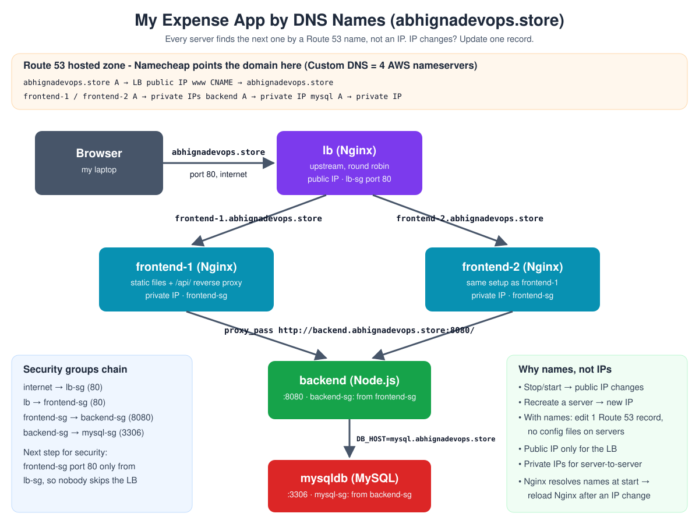

## Table of Contents

1. [Why use DNS names instead of IPs](#1-why-use-dns-names-instead-of-ips)
2. [Buy a domain (Namecheap)](#2-buy-a-domain-namecheap)
3. [Create the hosted zone in Route 53](#3-create-the-hosted-zone-in-route-53)
4. [Point the domain to Route 53 (Custom DNS)](#4-point-the-domain-to-route-53-custom-dns)
5. [Create the first records](#5-create-the-first-records)
6. [Backend: connect to MySQL by name](#6-backend-connect-to-mysql-by-name)
7. [Frontend-1: proxy to the backend by name](#7-frontend-1-proxy-to-the-backend-by-name)
8. [2 more servers: frontend-2 and lb](#8-2-more-servers-frontend-2-and-lb)
9. [Frontend-2: same setup as frontend-1](#9-frontend-2-same-setup-as-frontend-1)
10. [Records for the frontends + www](#10-records-for-the-frontends--www)
11. [Load balancer (Nginx upstream)](#11-load-balancer-nginx-upstream)
12. [Point the domain to the LB](#12-point-the-domain-to-the-lb)
13. [Test: round robin and failover](#13-test-round-robin-and-failover)
14. [Problems I hit](#14-problems-i-hit)
15. [3 load balancers in real projects](#15-3-load-balancers-in-real-projects)
16. [HTTPS with a TLS certificate](#16-https-with-a-tls-certificate)
17. [Summary](#17-summary)

---

## 1. Why use DNS names instead of IPs

- **Stop/start** an EC2 → its **public** IP changes. Recreate it → **both** IPs change.
- Before: the backend had the MySQL IP in `backend.service`, Nginx had the backend IP in `expense.conf`. Every IP change = edit files + restart, on every server.
- Now: every server uses a **name** like `mysql.abhignadevops.store`. IP changed → update **only the Route 53 record**.

```text
Browser → abhignadevops.store (lb) → frontend-1 / frontend-2 → backend.abhignadevops.store:8080 → mysql.abhignadevops.store:3306
```

---

## 2. Buy a domain (Namecheap)

There's no useful **free** domain for this lab:

| Option | Why not |
|---|---|
| Freenom (.tk, .ml) | Closed, no new registrations |
| DuckDNS / No-IP | Subdomain only - can't point nameservers to Route 53 |
| eu.org / is-a.dev | Free, but approval takes weeks / has rules |
| GitHub Student Pack | Free 1 year, needs a student email |

So I bought **`abhignadevops.store`** on Namecheap - **€0.87 first year + €0.18 ICANN fee = $1.18** total.

**Checkout checklist:**

| Setting | What I chose | Why |
|---|---|---|
| Period | **1 year** | 2-5 years jumped to €8-€160 |
| Domain privacy | **ON** (free) | Hides my name/address from the public WHOIS |
| PremiumDNS | ❌ not added | Route 53 does the DNS |
| Stellar Web Hosting "free trial" | ❌ **removed** | It's a monthly subscription after the trial - my site runs on EC2 |
| Email / SSL / VPN / SEO | ❌ skipped | Not needed |
| Auto-Renew | **OFF** | Renewal is **€39.47/yr** - way more than year 1 |

After paying:

1. Clicked the link in the "verify contact information" email (must be done within **15 days** or the domain gets suspended).
2. Searching the name again shows **"Taken"** - that's me, the owner. Don't click "Make offer".
3. `dig +short NS abhignadevops.store` → `dns1/dns2.registrar-servers.com` = live, using Namecheap's nameservers. It took only minutes.

> Pay with the **card number** (16 digits), not the IBAN (`PT50...`) - the IBAN is for bank transfers.

---

## 3. Create the hosted zone in Route 53

An **IAM user** with `AmazonRoute53FullAccess` (or Admin) is enough - no root login needed.

**Route 53 → Hosted zones → Create hosted zone** (I had 0 zones):

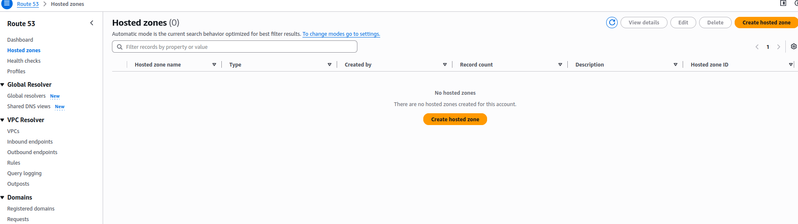

- Domain name: `abhignadevops.store` - **no** `www`, no `http://`, no dot at the end (Route 53 adds the dot itself).
- Type: **Public hosted zone** - the internet (my browser) must find it. A private zone answers only inside the VPC.

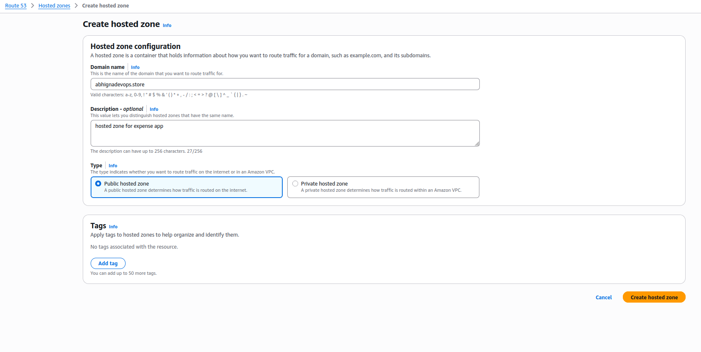

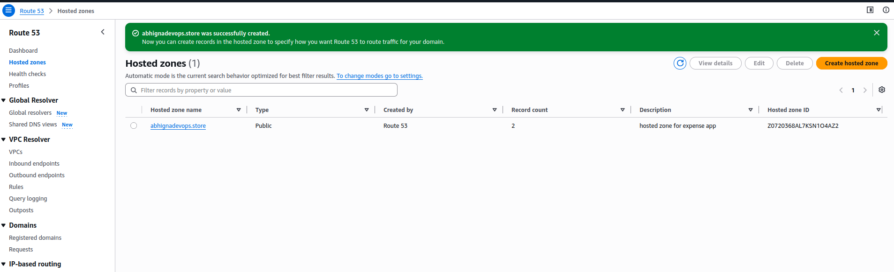

Route 53 creates 2 records by itself:

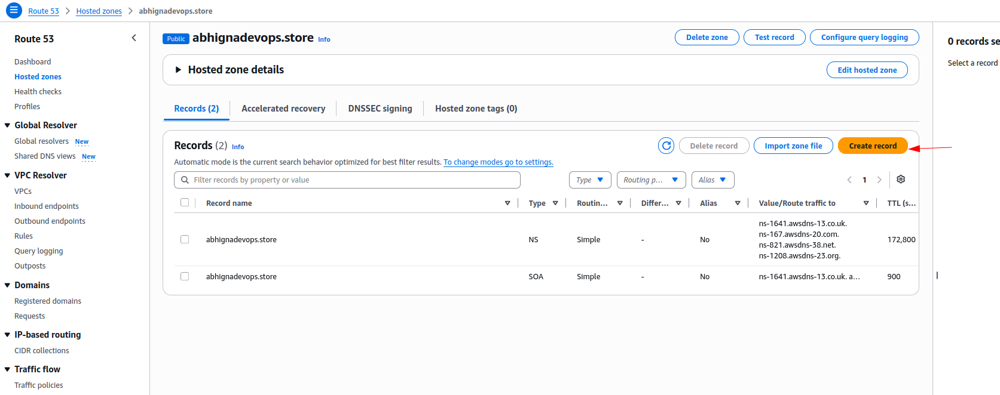

| Record | What it is | TTL |
|---|---|---|
| **NS** | 4 AWS nameservers in charge of my domain (in 4 TLDs - `.co.uk .com .net .org` - for high availability) | 172,800 (2 days) |
| **SOA** | Zone info: primary nameserver, admin email, timers. Its last number also sets how long "not found" is cached | 900 |

Don't edit or delete these two.

> The trailing dot in `abhignadevops.store.` = the **root** of DNS. A name with the dot is an **FQDN** (fully qualified domain name).

---

## 4. Point the domain to Route 53 (Custom DNS)

**Namecheap → Account → Dashboard → Domain List → Manage → NAMESERVERS → Custom DNS** → paste the 4 NS values **without** the dot at the end → green ✅ to save:

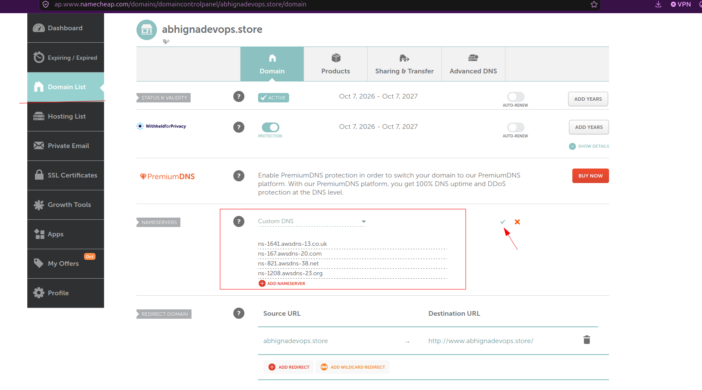

```text
ns-1641.awsdns-13.co.uk
ns-167.awsdns-20.com
ns-821.awsdns-38.net
ns-1208.awsdns-23.org
```

- Now the `.store` registry tells the internet **"ask Route 53"** about my domain.
- Namecheap says up to 48h - it took **a few minutes** for me. Check:

```bash
TLD=$(dig +short NS store. | head -1)
dig NS abhignadevops.store @$TLD +norec     # AUTHORITY: the 4 awsdns servers ✅
```

- The domain stays **registered and renewed at Namecheap**. Only DNS management moved to AWS.
- The **Redirect Domain** entry on that page stops working with Custom DNS - ignore or remove it.

---

## 5. Create the first records

**Hosted zone → Create record**. All: Type **A**, TTL **60**, Simple routing.

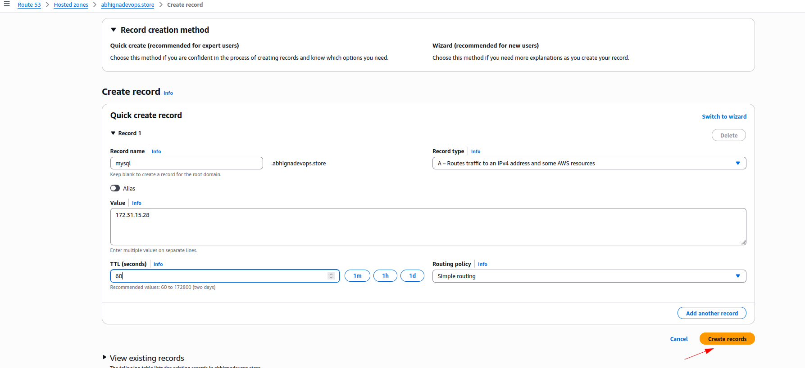

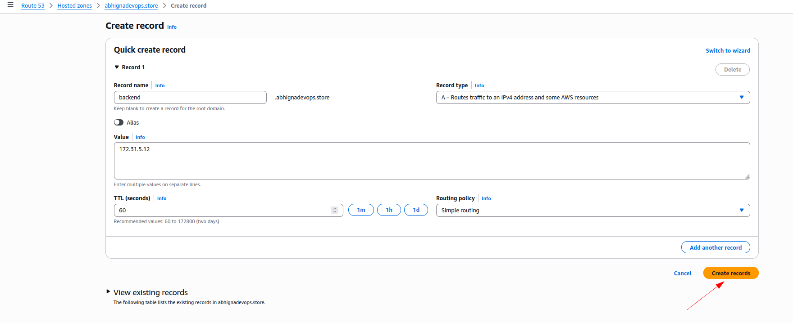

| Record name | Value | Why this IP |
|---|---|---|
| `mysql` | mysqldb **private** IP (`172.31.15.28`) | Only the backend talks to MySQL, inside the VPC |
| `backend` | backend **private** IP (`172.31.5.12`) | Only the frontends' Nginx talks to the backend |
| *(empty = root)* | frontend **public** IP (`3.237.184.179`) | I open it from my laptop over the internet (later → the LB) |

- **A record** = name → IPv4 address. Leave the name **empty** for the root domain (`abhignadevops.store`).
- **TTL 60** = if an IP changes, caches pick up the new one within a minute. 30-60s is right for labs.
- Check from my laptop: `dig +short mysql.abhignadevops.store @8.8.8.8` → `172.31.15.28` ✅

---

## 6. Backend: connect to MySQL by name

```bash
getent hosts mysql.abhignadevops.store       # → 172.31.15.28
vim /etc/systemd/system/backend.service
```

Only one line changed: `DB_HOST=<mysql-private-ip>` → `DB_HOST=mysql.abhignadevops.store`


```bash
systemctl daemon-reload            # service file changed
systemctl restart backend
curl http://localhost:8080/health  # {"status":"ok","db":"up"}
```

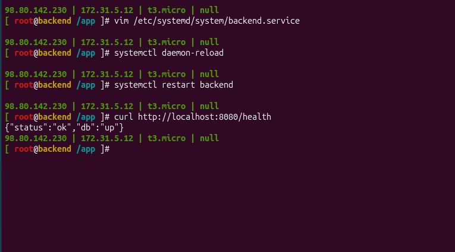

> `getent hosts <name>` works on every Linux server. `dig` / `nslookup` need `dnf install bind-utils -y`.

---

## 7. Frontend-1: proxy to the backend by name

```bash
getent hosts backend.abhignadevops.store     # → 172.31.5.12
vim /etc/nginx/default.d/expense.conf
```

Only the `proxy_pass` line changed: `http://<backend-private-ip>:8080/` → `http://backend.abhignadevops.store:8080/`

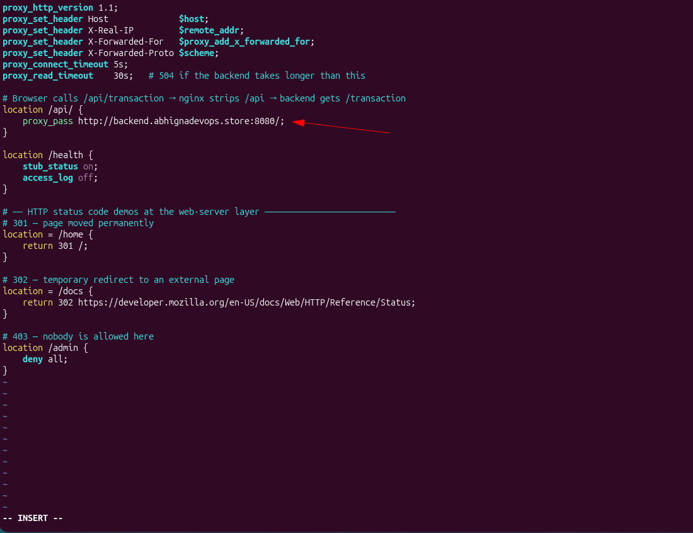

```bash
nginx -t
systemctl restart nginx
curl http://localhost/api/health   # {"status":"ok","db":"up"}
```

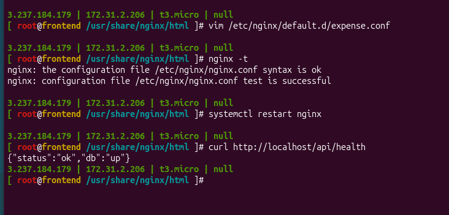

Now **http://abhignadevops.store** opens my app (root record → frontend-1 public IP):

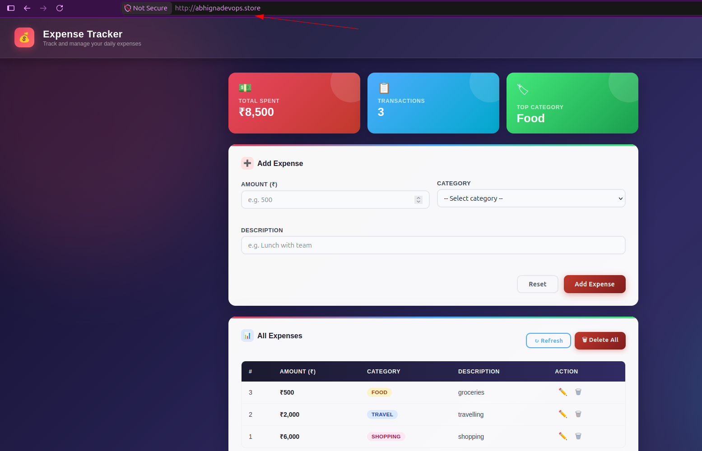

---

## 8. 2 more servers: frontend-2 and lb

Same AMI (`Redhat-9-DevOps-Practice`), t3.micro, same subnet.

| Server | Security group | Inbound |
|---|---|---|
| `frontend-2` | `frontend-sg` (same as frontend-1) | 80 from internet, 22 from My IP |
| `lb` | `lb-sg` (new) | 80 from `0.0.0.0/0`, 22 from My IP |

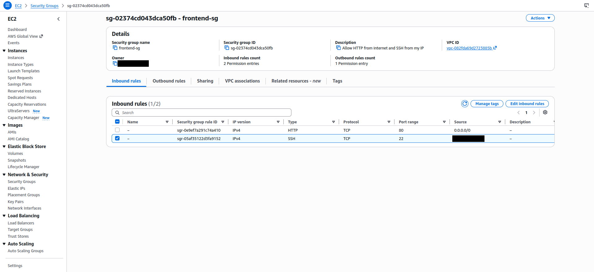

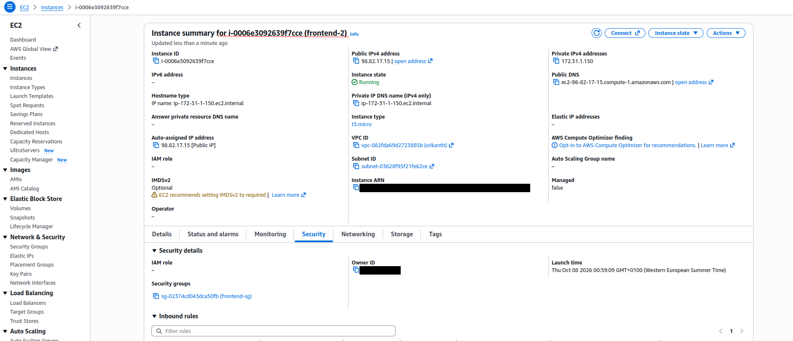

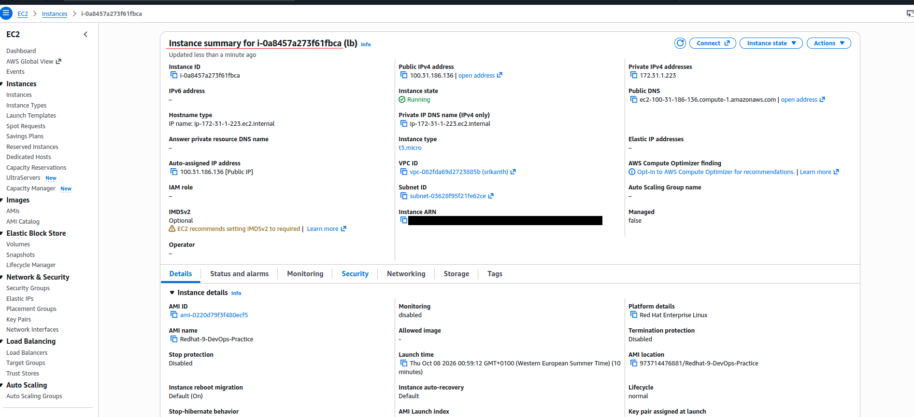

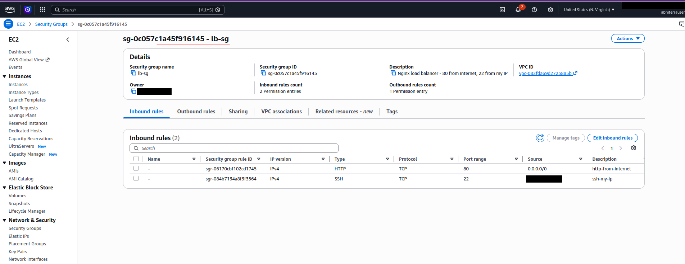

- `backend-sg` allows 8080 **from `frontend-sg`**, so frontend-2 can reach the backend with **no change**.
- `/32` after an IP = exactly that one IP. My home IP can change (router restart) → if SSH times out, update the 22 rule with **My IP**.

---

## 9. Frontend-2: same setup as frontend-1

```bash
sudo su -
hostnamectl set-hostname frontend-2 && exec bash
dnf install nginx -y
```

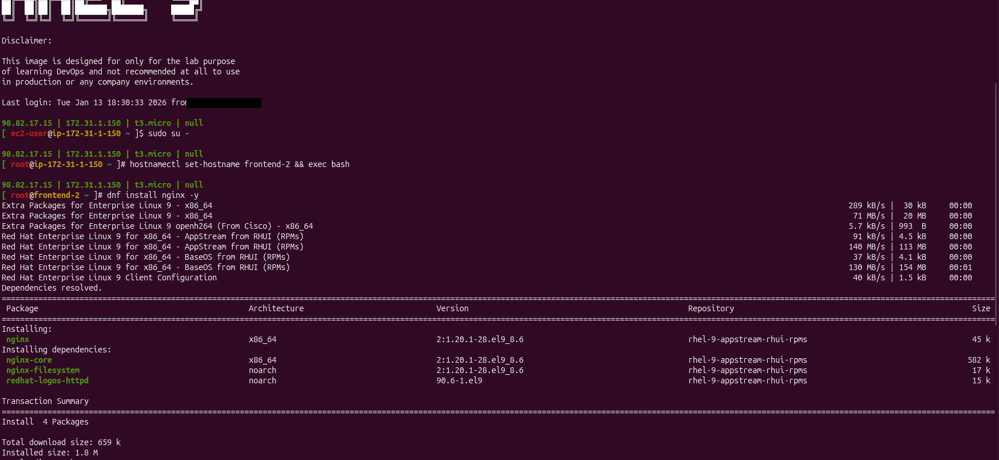

```bash
systemctl enable nginx
systemctl start nginx
rm -rf /usr/share/nginx/html/*
curl -o /tmp/frontend.tar.gz https://raw.githubusercontent.com/daws-92s/expense-documentation/refs/heads/main/artifacts/expense-frontend-v5.tar.gz
cd /usr/share/nginx/html
tar -xzf /tmp/frontend.tar.gz
vim /etc/nginx/default.d/expense.conf     # same file as frontend-1, proxy_pass by name
nginx -t
systemctl restart nginx
```

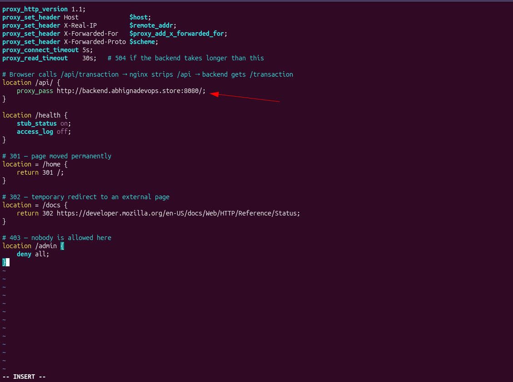

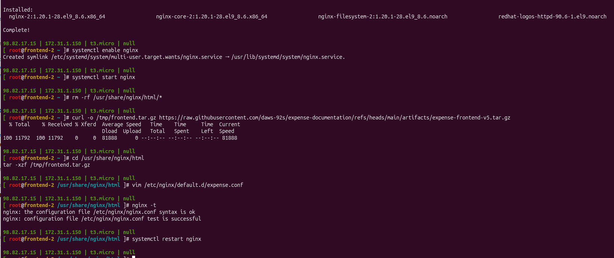

Check: `http://<frontend-2-public-ip>/api/health` → `{"status":"ok","db":"up"}` ✅

> Servers behind one LB must be **identical** - same files, same config. I used the full `expense.conf` (with the 301/302/403 demo blocks) on both.

---

## 10. Records for the frontends + www

| Record name | Type | Value | Used by |
|---|---|---|---|
| `frontend-1` | A | `172.31.2.206` (private) | LB `upstream` |
| `frontend-2` | A | `172.31.1.150` (private) | LB `upstream` |
| `www` | **CNAME** | `abhignadevops.store` | Browser, when someone types `www.` |

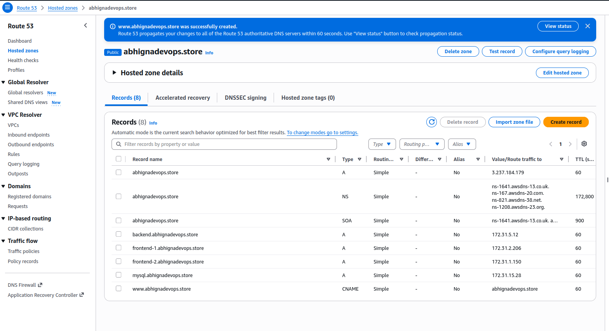

- **CNAME** = an alias: name → **another name**. When the root moves to the LB, `www` follows automatically.
- Click **Create records** at the bottom - my first try at these records wasn't saved because I didn't.

---

## 11. Load balancer (Nginx upstream)

The LB is also Nginx, but it serves **no app files** - it only spreads requests across the frontends.

```bash
sudo su -
hostnamectl set-hostname lb && exec bash
dnf install nginx -y
```

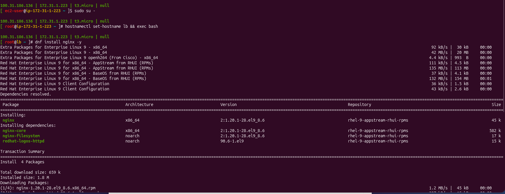

**1. Check both names resolve first** (or `nginx -t` fails):

```bash
getent hosts frontend-1.abhignadevops.store   # → 172.31.2.206
getent hosts frontend-2.abhignadevops.store   # → 172.31.1.150
```

**2. Back up and replace the main config** `/etc/nginx/nginx.conf`:

```bash
cp /etc/nginx/nginx.conf /etc/nginx/nginx.conf.bak
cat > /etc/nginx/nginx.conf <<'EOF'
user nginx;
worker_processes auto;
error_log /var/log/nginx/error.log;
pid /run/nginx.pid;

include /usr/share/nginx/modules/*.conf;

events {
    worker_connections 1024;
}

http {
    log_format  main  '$remote_addr - $remote_user [$time_local] "$request" '
                      '$status $body_bytes_sent "$http_referer" '
                      '"$http_user_agent" "$http_x_forwarded_for" upstream=$upstream_addr';

    access_log  /var/log/nginx/access.log  main;

    sendfile            on;
    tcp_nopush          on;
    tcp_nodelay         on;
    keepalive_timeout   65;
    types_hash_max_size 4096;

    include             /etc/nginx/mime.types;
    default_type        application/octet-stream;

    upstream my_frontend_cluster {
        server frontend-1.abhignadevops.store:80;
        server frontend-2.abhignadevops.store:80;
    }

    server {
        listen       80;
        listen       [::]:80;
        server_name  _;

        location / {
            proxy_pass            http://my_frontend_cluster;
            proxy_set_header      Host              $host;
            proxy_set_header      X-Real-IP         $remote_addr;
            proxy_set_header      X-Forwarded-For   $proxy_add_x_forwarded_for;
            proxy_connect_timeout 5s;
            proxy_read_timeout    10s;
        }
    }
}
EOF
```

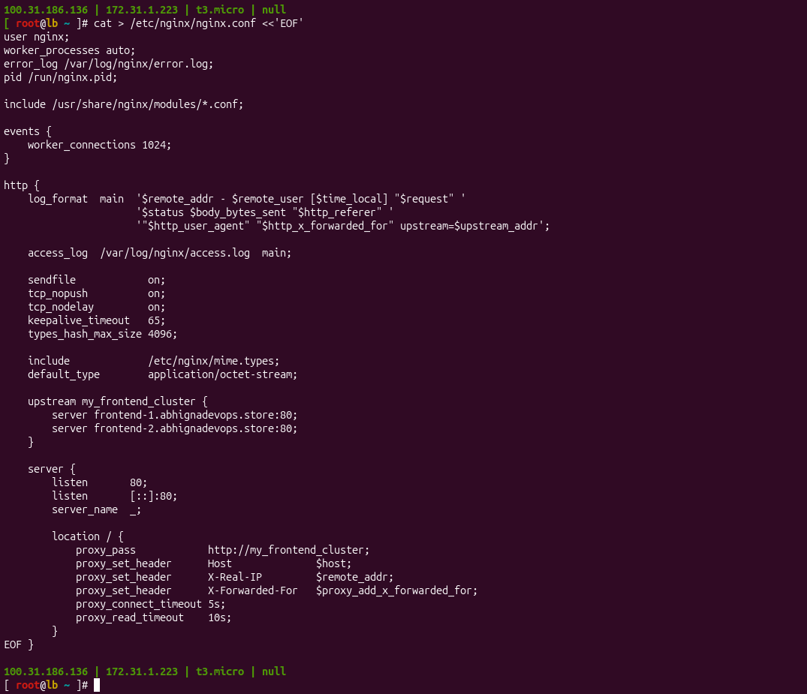

| Part | Meaning |
|---|---|
| `upstream my_frontend_cluster` | The group of servers that share the traffic |
| `server frontend-1...:80` | One member, found by its Route 53 name |
| `proxy_pass http://my_frontend_cluster` | Send every request to that group |
| `X-Forwarded-For` | Passes the user's real IP on to the frontends |
| `upstream=$upstream_addr` (my addition to the log) | Shows **which frontend** served each request |

**3. Test and start:**

```bash
nginx -t
systemctl enable nginx
systemctl start nginx
curl http://localhost/api/health     # {"status":"ok","db":"up"} = lb → frontend → backend → mysql ✅
```

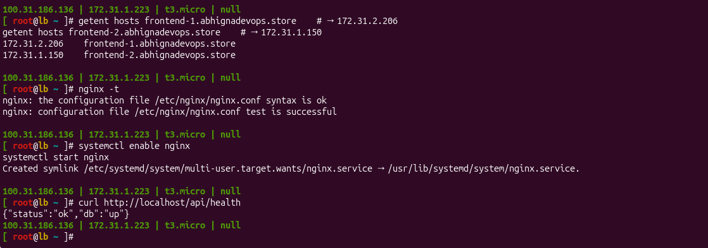

> My first `nginx -t` failed with `host not found in upstream` - see [Problem 3](#problem-3---nginx--t-host-not-found-in-upstream-negative-caching).

---

## 12. Point the domain to the LB

Route 53 → tick the **A** row of `abhignadevops.store` (not NS / SOA) → **Edit record** → Value `100.31.186.136` (LB public IP) → **Save**.

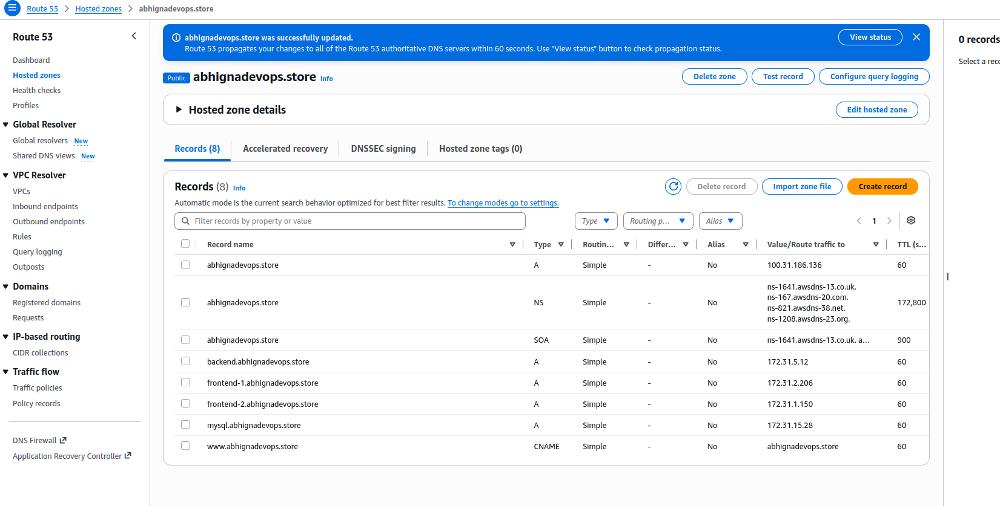

- Value must be a plain IP - **no dot at the end** (`100.31.186.136.` is invalid). Trailing dots are for names only.
- After Save, a blue banner says "successfully updated" - before Save, nothing changes.
- `www` (CNAME) followed automatically.

---

## 13. Test: round robin and failover

**Round robin** - on the lb, then refresh the browser:

```bash
tail -f /var/log/nginx/access.log
```

```text
<my-ip> ... "GET / HTTP/1.1" 304 0 ...                 upstream=172.31.1.150:80
<my-ip> ... "GET /api/transaction HTTP/1.1" 200 218 ... upstream=172.31.2.206:80
<my-ip> ... "GET / HTTP/1.1" 304 0 ...                 upstream=172.31.1.150:80
<my-ip> ... "GET /api/transaction HTTP/1.1" 200 218 ... upstream=172.31.2.206:80
```

| In the log | Meaning |
|---|---|
| `upstream=` switches every line | **Round robin** - each new request goes to the next frontend |
| `/` always on frontend-2, `/api` always on frontend-1 | Each refresh = **2 requests**. Round robin counts **requests**, not page loads - still 50/50 |
| `304` | Not Modified - browser already had the page cached, server sent 0 bytes |
| `404` on `/favicon.ico` | The app has no tab icon - harmless |
| first column | the user's real IP (mine - blacked out) |

**Failover:**

1. On frontend-1: `systemctl stop nginx`
2. Refresh the browser → still works. The lb log shows only `upstream=172.31.1.150:80`.
3. On frontend-1: `systemctl start nginx` → both appear again.

---

## 14. Problems I hit

Full details with a diagram → [troubleshooting/](../troubleshooting/README.md)

### Problem 1 - Browser got redirected to `www` instead of my app

- **Cause:** I opened the domain **before** switching to Route 53. My **home router** cached Namecheap's redirect server `192.64.119.37` (TTL ~30 min).
- **Proof:** `dig abhignadevops.store @192.168.1.254` → `192.64.119.37 TTL 1311`, while `@8.8.8.8` → my IP.
- **Fix:** waited ~20 min (or use 8.8.8.8 / phone on mobile data).

### Problem 2 - `www.abhignadevops.store` "Server Not Found"

- **Cause:** no `www` record existed yet - and the first time I created it, I didn't click **Create records**.
- **Fix:** CNAME `www` → `abhignadevops.store`, and check it appears in the list.

### Problem 3 - `nginx -t`: host not found in upstream (negative caching)

```text
nginx: [emerg] host not found in upstream "frontend-1.abhignadevops.store:80" in /etc/nginx/nginx.conf:29
```

- **Cause:** I ran `getent` on the lb **before** the records existed. The **VPC resolver** (`172.31.0.2`) cached **"not found" (NXDOMAIN)** for the SOA time - **900s**.
- **Proof:** `dig ... @8.8.8.8` → `172.31.2.206` ✅ but plain `dig` → `status: NXDOMAIN`, SOA TTL `246` counting down.
- **Fix:** waited ~4 min → `getent` printed the IPs → `nginx -t` passed.

### Problem 4 - Root record "changed" but still the old IP

- **Cause:** I typed the new IP but **didn't click Save** (and the first time, the value had a trailing dot `100.31.186.136.`).
- **Fix:** remove the dot → **Save** → wait for the "successfully updated" banner.

### Problem 5 - `www` showed Namecheap's "recently registered" page

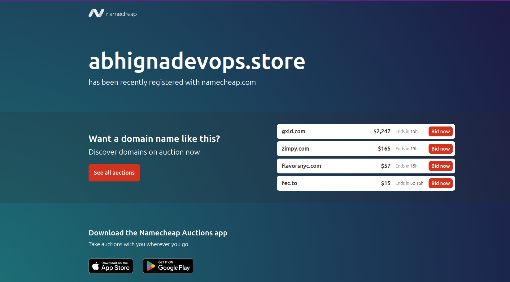

- **Cause:** DNS was right everywhere (`curl` worked), but **Firefox** had cached the old parking page / its own DNS (plus the browser VPN uses its own DNS).
- **Fix:** `Ctrl+Shift+R` → `about:networking#dns` → **Clear DNS Cache** → VPN off / private window.

---

## 15. 3 load balancers in real projects

In real projects every tier gets its own LB, not just the frontend:

```text
Users → [Public LB] → frontend-1 / frontend-2
                          │
                     [Backend LB] → backend-1 / backend-2
                                         │
                                    [DB LB] → db-1 / db-2
```

| LB | Sits before | Public / private | Managed by |
|----|-------------|------------------|------------|
| Frontend LB | Frontend servers | **Public** - users reach it from the internet | Us (DevOps) |
| Backend LB | Backend servers | Private - only frontends talk to it | Us (DevOps) |
| DB LB | DB servers | Private - only backends talk to it | **DB team** |

- Only the frontend LB is public. The other two stay inside the VPC.
- Each tier can then have many servers. If one goes down, its LB sends traffic to the others.

---

## 16. HTTPS with a TLS certificate

Right now the site is `http://` (Firefox shows **Not Secure**) - traffic is **not encrypted**.

1. Get a **TLS certificate** for the domain - from AWS (ACM), Let's Encrypt (free), or buy one.
2. Add it to the **public LB** (the one users hit).
3. The site becomes `https://abhignadevops.store` - traffic between the user and the LB is encrypted, and the browser shows the lock 🔒.

> TLS (Transport Layer Security) is the newer name for SSL. "SSL certificate" and "TLS certificate" mean the same thing day to day.

---

## 17. Summary

| Server | What changed | Record used |
|---|---|---|
| backend | `DB_HOST` in `backend.service` | `mysql` → MySQL private IP |
| frontend-1, frontend-2 | `proxy_pass` in `expense.conf` | `backend` → backend private IP |
| lb | `/etc/nginx/nginx.conf` → `upstream` | `frontend-1` / `frontend-2` → private IPs |
| Users | Open the app by name | root → LB public IP, `www` → CNAME to root |

- IP changed? → update the **Route 53 record** only. No file edits.
- **Nginx catch:** Nginx looks up names **only when it starts**. After an IP change, run `systemctl reload nginx`.
- **Create records before** any server looks them up - "not found" gets cached too.
- Keep TTL **60** in labs. Before a real migration, **lower the TTL first**, wait one old-TTL period, then change.
- Stop/start servers → only the **public** IPs change → update the root record to the lb's new IP.
- Cost: domain $1.18 for year 1 (auto-renew OFF) + hosted zone **$0.50/month** (delete it when the lab is over).
