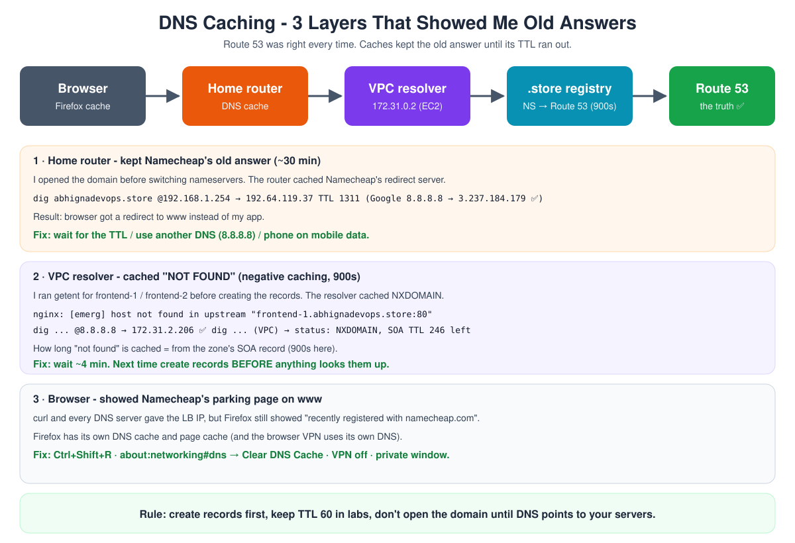

# Day 9 - DNS Troubleshooting Step by Step

[← Back to Day 9 notes](../README.md) · [Hands-on](../hands-on/README.md)

Everything I hit while moving my expense app to `abhignadevops.store`. In **every** case Route 53 was correct. A **cache** somewhere still had an old answer.



## Table of Contents

1. [Rule: Ask Route 53 Directly, Then Each Cache](#rule-ask-route-53-directly-then-each-cache)
2. [Commands to Check DNS](#commands-to-check-dns)
3. [Example: Home Router Cached Namecheap's Old Answer](#example-home-router-cached-namecheaps-old-answer)
4. [Example: nginx -t "host not found in upstream" (Negative Caching)](#example-nginx--t-host-not-found-in-upstream-negative-caching)
5. [Example: www Shows Namecheap's Parking Page](#example-www-shows-namecheaps-parking-page)
6. [Example: www "Server Not Found"](#example-www-server-not-found)
7. [Example: Record Edited but Still the Old IP](#example-record-edited-but-still-the-old-ip)
8. [Example: Nameservers Saved but Still Namecheap](#example-nameservers-saved-but-still-namecheap)
9. [Who Caches DNS and for How Long](#who-caches-dns-and-for-how-long)
10. [Quick Checklist](#quick-checklist)

---

## Rule: Ask Route 53 Directly, Then Each Cache

When a name gives the wrong answer, don't change the records straight away. Go **from the source outwards**:

1. **Route 53 itself** (the truth) → `dig +short <name> @ns-167.awsdns-20.com`
2. **A public resolver** → `dig +short <name> @8.8.8.8`
3. **The resolver your machine uses** → laptop: the router (`192.168.1.254`), EC2: the VPC resolver (`172.31.0.2`)
4. **The app** → browser / Nginx

Where the answer goes wrong = the layer with the old cache. The `TTL` number in `dig` = **seconds until it forgets**.

## Commands to Check DNS

| Command | Where | Shows |
|---|---|---|
| `getent hosts <name>` | any Linux | What the system resolves (no install needed). Empty = not found |
| `dig +short <name>` | needs `bind-utils` | Just the answer |
| `dig <name> @8.8.8.8` | | Ask a specific resolver |
| `dig <name> +noall +answer` | | Answer with the **TTL left** |
| `dig NS <domain> @<tld-server> +norec` | | What the **registry** has (are the nameservers switched?) |
| `cat /etc/resolv.conf` | | Which resolver this server uses |
| `resolvectl flush-caches` | Ubuntu laptop | Clears the laptop's own cache (not the router's) |
| `curl --resolve <name>:80:<ip> http://<name>/` | | Test the app **by name** against a chosen IP, skipping DNS |

## Example: Home Router Cached Namecheap's Old Answer

**Symptom:** `http://abhignadevops.store` redirected to `www.abhignadevops.store` instead of opening my app.

**What I checked:**

| Check | Result |
|---|---|
| `dig +short abhignadevops.store @8.8.8.8` | `3.237.184.179` ✅ (my frontend) |
| `resolvectl query abhignadevops.store` (laptop) | `192.64.119.37` ❌ |
| `dig abhignadevops.store @192.168.1.254 +noall +answer` (router) | `192.64.119.37` **TTL 1311** ❌ |
| `curl --resolve abhignadevops.store:80:3.237.184.179 http://abhignadevops.store/api/health` | `{"status":"ok","db":"up"}` ✅ |

**Root cause:** I opened the domain **before** switching to Route 53. The router cached Namecheap's **redirect server** (`192.64.119.37`) for ~30 minutes. Flushing the laptop cache didn't help - the router has its own.

**Fix:** waited the TTL out (~20 min). Faster: phone on mobile data, or set the laptop DNS to `8.8.8.8` / `1.1.1.1`.

**Lesson:** after buying a domain, **don't open it** until DNS points to your servers.

## Example: nginx -t "host not found in upstream" (Negative Caching)

**Symptom:** on the lb:

```text
nginx: [emerg] host not found in upstream "frontend-1.abhignadevops.store:80" in /etc/nginx/nginx.conf:29
nginx: configuration file /etc/nginx/nginx.conf test failed
```

and `getent hosts frontend-1.abhignadevops.store` printed **nothing**.

**What I checked (on the lb):**

| Check | Result | Meaning |
|---|---|---|
| `getent hosts backend.abhignadevops.store` | `172.31.5.12` ✅ | The lb's DNS works (older record) |
| `cat /etc/resolv.conf` | `nameserver 172.31.0.2` | Uses the VPC resolver (VPC base + 2) |
| `dig +short frontend-1.abhignadevops.store @8.8.8.8` | `172.31.2.206` ✅ | The record exists |
| `dig frontend-1.abhignadevops.store` | `status: NXDOMAIN`, SOA TTL **246** | VPC resolver still serves a cached "not found" |

**Root cause:** I ran `getent` on the lb **before** creating the `frontend-1` / `frontend-2` records. The VPC resolver cached the **NXDOMAIN** ("no such name"). This is **negative caching**. It's kept for the time in the zone's **SOA** record - **900s** for Route 53 zones.

**Fix:** waited until the SOA TTL ran out (~4 min), then:

```bash
getent hosts frontend-1.abhignadevops.store   # 172.31.2.206 ✅
nginx -t                                      # test is successful
```

Can't wait? Put the private IPs in `upstream` for now, switch back to names later.

**Lesson:** create DNS records **before** any server looks them up.

> **Interview one-liner:** "NXDOMAIN answers are cached too - negative caching - for the time set in the SOA record. So create the records before anything queries them."

## Example: www Shows Namecheap's Parking Page

**Symptom:** `http://www.abhignadevops.store` in Firefox showed *"abhignadevops.store has been recently registered with namecheap.com"*.


**What I checked:** Google DNS, my router and my laptop all said `www` → `abhignadevops.store` → LB IP. `curl http://www.abhignadevops.store/api/health` from the same laptop → `{"status":"ok","db":"up"}` ✅.

**Root cause:** **Firefox** had cached the old page / its own DNS answer from before the switch. The browser's VPN also uses its own DNS.

**Fix (in order):**

1. `Ctrl + Shift + R` (hard refresh)
2. `about:networking#dns` → **Clear DNS Cache**
3. Turn the browser VPN off
4. Private window (`Ctrl + Shift + P`)
5. History → right-click the site → **Forget About This Site**

**Lesson:** if `curl` works but the browser doesn't, it's the **browser's** cache.

## Example: www "Server Not Found"

**Symptom:** Firefox: *"can't connect to the server at www.abhignadevops.store"*. Firefox jumped to `www` because the old Namecheap redirect pointed there.

**Root cause:** no `www` record existed. The first time I filled the form I never clicked **Create records**, so `aws route53 list-resource-record-sets` didn't show it.

**Fix:** CNAME `www` → `abhignadevops.store`, TTL 60 → **Create records** → check it appears in the list.

## Example: Record Edited but Still the Old IP

**Symptom:** I "changed" the root record to the LB, but `dig` and Route 53 still showed `3.237.184.179`.

**Root cause:**

1. Nothing was ticked ("0 records selected"), so **Edit record** wasn't open.
2. Then the value had a **trailing dot**: `100.31.186.136.` - invalid for an A record. Dots at the end are for **names** (FQDNs) only.
3. The form wasn't **saved**.

**Fix:** tick the **A** row (not NS/SOA) → Edit record → `100.31.186.136` → **Save** → wait for *"successfully updated"*. Live everywhere within ~60s (TTL 60).

## Example: Nameservers Saved but Still Namecheap

**Symptom:** right after saving Custom DNS, `dig +short NS abhignadevops.store` still showed `dns1/dns2.registrar-servers.com`.

**Check the registry itself:**

```bash
TLD=$(dig +short NS store. | head -1)
dig NS abhignadevops.store @$TLD +norec      # AUTHORITY section
dig +short SOA abhignadevops.store @ns-167.awsdns-20.com   # does Route 53 answer?
```

**Root cause:** the registry hadn't updated yet. The `.store` registry keeps NS for **900s**, and only the registry sets that TTL.

**Fix:** wait. Mine switched within minutes. Meanwhile I created the records in Route 53 - they were ready the moment the registry switched.

## Who Caches DNS and for How Long

| Layer | Who sets the TTL | Can I change it? | What I hit |
|---|---|---|---|
| Browser (Firefox) | Browser / its DoH or VPN | Clear it manually | Old parking page on `www` |
| Laptop OS (systemd-resolved) | Record TTL | `resolvectl flush-caches` | - |
| Home router | Record TTL | Wait / use another DNS | Namecheap redirect IP, ~30 min |
| VPC resolver (EC2) | Record TTL, SOA for "not found" | Wait | NXDOMAIN for 900s |
| TLD registry (NS) | The registry (900s for `.store`) | ❌ no | Nameserver switch delay |
| My records | Me (TTL 60) | ✅ yes | - |

**TTL rule of thumb:**

| TTL | When |
|---|---|
| 30-60s | Labs, testing, just before a planned change |
| 300s | Normal for apps whose IPs might change |
| 3600s+ | Stable production records |

> Before a real migration: **lower the TTL first**, wait one old-TTL period, then change. Raise it back after.

## Quick Checklist

1. `dig @ns-...awsdns...` - is the record right **in Route 53**? If not → fix the record (and click **Save** / **Create records**).
2. `dig @8.8.8.8` - does the internet see it? If not → nameservers / registry.
3. `dig` with the server's own resolver - is the TTL still counting down? → wait, or test with `curl --resolve`.
4. `curl` works but the browser doesn't → browser cache / VPN.
5. Nginx uses names → it resolves them **at start**. After an IP change: `systemctl reload nginx`.
