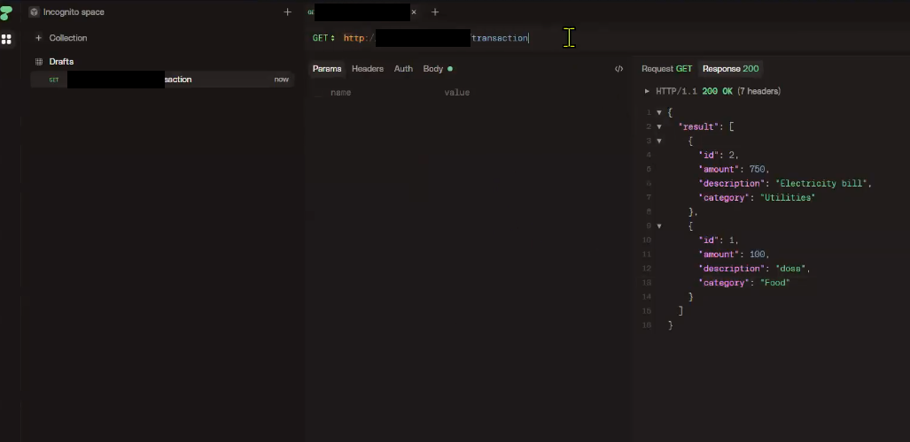

# Day 9 - Nginx Directories, API Testing & Status Codes

## Table of Contents

1. [Why Know These Paths](#why-know-these-paths)
2. [The 4 Important Paths](#the-4-important-paths)
   - [/etc/nginx/nginx.conf - Main Configuration](#etcnginxnginxconf---main-configuration)
   - [/usr/share/nginx/html - HTML Directory](#usrsharenginxhtml---html-directory)
   - [/var/log/nginx - Logs Directory](#varlognginx---logs-directory)
   - [/etc/nginx/default.d/expense.conf - Our Custom Config](#etcnginxdefaultdexpenseconf---our-custom-config)
3. [Never Edit the Main Config - Use a Separate File](#never-edit-the-main-config---use-a-separate-file)
4. [How an API Request Travels](#how-an-api-request-travels)
5. [Testing the Backend API](#testing-the-backend-api)
   - [Health Check](#health-check)
   - [Why Not Just the Browser?](#why-not-just-the-browser)
   - [Backend API Endpoints](#backend-api-endpoints)
   - [Testing with HTTPie / Postman (Screenshots)](#testing-with-httpie--postman-screenshots)
6. [HTTP Status Codes](#http-status-codes)
   - [Status Codes We Saw While Testing](#status-codes-we-saw-while-testing)
   - [Test It Yourself: Stop the DB → 503](#test-it-yourself-stop-the-db--503)
   - [504 Gateway Timeout - How Long Nginx Waits](#504-gateway-timeout---how-long-nginx-waits)
7. [Summary](#summary)
8. [Interview Questions](#interview-questions)

**Diagrams:** [API Request Flow](images/01-api-request-flow.svg) · [What Causes Each Status Code](images/02-what-causes-each-status-code.svg)

---

## Why Know These Paths

When Nginx is installed, it keeps its files in fixed places. Everything we do with Nginx - changing settings, putting our website, checking errors - happens in one of these 4 paths. If you know them, you can set up and troubleshoot Nginx on any server.

## The 4 Important Paths

| Path | What's there | We use it to |
|------|--------------|--------------|
| `/etc/nginx/nginx.conf` | Main Nginx configuration file | Check the default settings (port, root folder, log format) |
| `/usr/share/nginx/html` | Nginx HTML directory | Put our website files (HTML/CSS/JS) |
| `/var/log/nginx` | Nginx logs directory | See requests and errors |
| `/etc/nginx/default.d/expense.conf` | Our expense reverse proxy config | Add our own custom settings |

```text
/etc/nginx/
├── nginx.conf              ← main config (don't edit)
└── default.d/
    └── expense.conf        ← our custom config (edit here)

/usr/share/nginx/html/      ← website files (index.html ...)

/var/log/nginx/
├── access.log              ← every request
└── error.log               ← errors
```

### /etc/nginx/nginx.conf - Main Configuration

The **main** Nginx configuration file. Nginx reads it when it starts. It has the default settings, for example:

- `listen 80;` → which port Nginx listens on
- `root /usr/share/nginx/html;` → which folder the website files are served from
- `log_format` / `access_log` → how and where requests are logged
- `include /etc/nginx/default.d/*.conf;` → load our extra config files

We **read** this file to understand the setup, but we **don't edit** it.

### /usr/share/nginx/html - HTML Directory

The folder where the **website files** live. Whatever we put here, Nginx serves to the browser.

- After install it has the default Nginx test page (`index.html`).
- For our app, we delete the default content and extract our expense frontend files here.
- `http://<public-ip>/` → Nginx serves `/usr/share/nginx/html/index.html`.

### /var/log/nginx - Logs Directory

Where Nginx writes its **logs**:

| File | What's in it |
|------|--------------|
| `access.log` | Every request - client IP, time, URL, status code, browser |
| `error.log` | Errors - when something fails, the reason is here |

```bash
tail -f /var/log/nginx/access.log    # watch requests live
tail -f /var/log/nginx/error.log     # watch errors live
```

### /etc/nginx/default.d/expense.conf - Our Custom Config

Our **own** config file for the expense app. When we need **extra configuration**, we add it here. In our case, it has the **reverse proxy** settings - send every `/api/` request to the backend:

```nginx
location /api/ {
    proxy_pass http://<backend-private-ip>:8080/;
}
```

The main `nginx.conf` automatically loads every `.conf` file in `/etc/nginx/default.d/`, so we just create the file - no need to touch the main config.

## Never Edit the Main Config - Use a Separate File

If we need any **custom config**, we add it in a **separate file** (`/etc/nginx/default.d/<name>.conf`) - we **do not edit** the main `nginx.conf`.

Why:

- The **main configuration does not get disturbed** - the default setup keeps working.
- If our custom config has a mistake, we only fix or delete **our own file**.
- All our changes are in one place - easy to find, copy or remove.
- Package updates can replace the main file, but our file stays.

Same idea as sudo: we add a file in `/etc/sudoers.d/` instead of editing the main `/etc/sudoers`.

After adding or changing any config file:

```bash
nginx -t                     # check the syntax is correct
systemctl restart nginx      # apply the change
```

## How an API Request Travels


When we add an expense in the app, the browser sends the request to the **frontend** - never directly to the backend:

```text
Browser → http://<frontend-public-ip>/api/transaction
Method: POST
Body:   {"amount": 100, "category": "Food", "description": "dosa"}
Response → 201 Created
```

What happens behind the scenes:

1. The request reaches **Nginx** on the frontend.
2. The path starts with `/api`, so Nginx **forwards** it to the backend. `/api/transaction` is converted to the backend URL:
   ```text
   http://<backend-private-ip>:8080/transaction
   ```
3. The **backend** takes the data and saves it in the **DB**.
4. The backend sends the response back → Nginx → browser (`201 Created`).

So one request passes through **one server to another**: browser → frontend → backend → DB, and the answer comes back the same way.

- The `/api` → backend forwarding is our **Nginx config** (`location /api/ { proxy_pass ... }` in `expense.conf`).
- The API URLs (`/transaction`, `/health`) and what they return are **written by the developers**.
- That's how the app can show everything together: the **frontend** gives the look (layout, colours), and the **data** comes from the DB through the backend.

## Testing the Backend API

### Health Check

The quickest test - is the backend running and can it reach the DB?

```bash
curl http://<backend-ip>:8080/health
```

```json
{"status":"ok","db":"up"}
```

`status: ok` means the backend is working. `db: up` means it can talk to MySQL.

> To call the backend directly from your laptop, port **8080** must be allowed in the backend's security group. Allow it only from **My IP**, only while testing, and remove it after - normally only the frontend should reach 8080. From the frontend server you can always test with its **private** IP.

### Why Not Just the Browser?

When you type a URL in the browser's address bar, the browser always sends a **GET**. So from the browser we can only **get** (read) information - we can't **post**, update or delete.

To test all methods, we use **API testing tools**:

| Tool | Type |
|------|------|
| **Postman** | Desktop/web app - most popular |
| **HTTPie** | Web/desktop app + command line |
| **curl** | Command line, already on every Linux server |

In these tools we choose the **method**, type the **URL**, add the **JSON body**, click Send, and see the **status code** and **response**.

### Backend API Endpoints

Calling the backend directly on port 8080 (no `/api` here - that's only on the frontend):

| Method | URL | What it does |
|--------|-----|--------------|
| `GET` | `http://<backend-ip>:8080/transaction` | Get **all** transactions |
| `GET` | `http://<backend-ip>:8080/transaction/2` | Get the transaction with **ID 2** |
| `POST` | `http://<backend-ip>:8080/transaction` | Add a new transaction (JSON body below) |
| `DELETE` | `http://<backend-ip>:8080/transaction/4` | Delete transaction **4** |
| `DELETE` | `http://<backend-ip>:8080/transaction/` | Delete **all** transactions (needs an admin token) |
| `GET` | `http://<backend-ip>:8080/health` | Health check |

`POST` body:

```json
{
  "amount": 750,
  "description": "Electricity bill",
  "category": "Utilities"
}
```

Same with `curl`:

```bash
curl http://<backend-ip>:8080/transaction                     # GET all
curl http://<backend-ip>:8080/transaction/2                   # GET one
curl -X POST http://<backend-ip>:8080/transaction \
     -H "Content-Type: application/json" \
     -d '{"amount": 750, "description": "Electricity bill", "category": "Utilities"}'
curl -X DELETE http://<backend-ip>:8080/transaction/4         # DELETE one
```

### Testing with HTTPie / Postman (Screenshots)

**1. POST a new transaction → `201 Created`** - the backend saved it and gave it `id: 2`.


**2. GET all transactions → `200 OK`** - the new one (`id: 2`) is now in the list.



**3. POST with broken JSON → `400 Bad Request`** - the closing `"` after `Utilities` is missing, so the input is not correct (`malformed JSON body`). Our mistake → 4XX.


**4. DELETE all without a token → `401 Unauthorized`** - deleting everything is an admin action, and we didn't send any credentials (`admin token required`).


## HTTP Status Codes

The **first digit** tells you the result:

| Starts with | Meaning |
|-------------|---------|
| **2XX** | Success |
| **3XX** | Redirect |
| **4XX** | Client-side error (our mistake) |
| **5XX** | Server-side error (app/server problem) |

### Status Codes We Saw While Testing


| Code | Name | In simple words |
|------|------|-----------------|
| `200` | OK | Request worked, here's the data |
| `201` | Created | New data saved (after `POST`) |
| `301` | Moved permanently | The page has a new location - it's sent in the response and the browser goes there automatically |
| `304` | Not modified | Nothing changed since last time - use your old (cached) response |
| `400` | Bad request | Input is not correct (e.g. broken JSON) |
| `401` | Unauthorized | **No credentials** sent (e.g. no admin token) |
| `403` | Forbidden | Credentials sent, but **wrong / not allowed** |
| `404` | Not found | Asking for something that isn't there |
| `405` | Method not allowed | The URL exists, but not for that method (e.g. `PUT` when the API doesn't support it) |
| `500` | Internal server error | Something broke inside the app - check the backend logs |
| `502` | Bad gateway | **Backend down** - Nginx can't connect to it |
| `503` | Service unavailable | The service can't work right now - e.g. **DB down** |
| `504` | Gateway timeout | Backend is up but didn't answer in time |

> **401 vs 403:** 401 = "who are you?" (no credentials). 403 = "I know who you are, but you're not allowed".

### Test It Yourself: Stop the DB → 503

On the **DB server**, stop MySQL:

```bash
systemctl stop mysqld
```

Now open the app or call the API:

```bash
curl -i http://<backend-ip>:8080/health      # -i shows the status code too
```

You get **`503 Service Unavailable`** - the backend is running, but the DB behind it is down, so it can't serve the request. Start MySQL again and it works:

```bash
systemctl start mysqld
```

Same idea for 502: stop the **backend** (`systemctl stop backend`) and open the app → Nginx can't reach the backend → **`502 Bad Gateway`**.

### 504 Gateway Timeout - How Long Nginx Waits

```text
frontend (Nginx) → backend → database
```

When Nginx forwards a request to the backend, it **waits** for the answer - but only up to a time limit. If the backend doesn't reply within that time, Nginx stops waiting and sends the user **`504 Gateway Timeout`**.

The time limit is set in the Nginx config:

| Setting | What it limits | Nginx default | Our `expense.conf` |
|---------|----------------|---------------|--------------------|
| `proxy_connect_timeout` | Time to **connect** to the backend | 60s | `5s` |
| `proxy_read_timeout` | Time to wait for the backend's **reply** | 60s | `30s` |

```nginx
proxy_connect_timeout 5s;
proxy_read_timeout    30s;   # 504 if the backend takes longer than this
```

So in our setup:

- Backend answers within **30 seconds** → user gets the normal response (`200`, `201` ...).
- Backend is up but takes **more than 30 seconds** (slow DB query, stuck code) → Nginx gives up → **`504 Gateway Timeout`**.
- If we didn't set `proxy_read_timeout`, Nginx would wait the default **60 seconds** before giving the 504.

**Why not wait forever?** The user would just see a loading page, and every waiting request keeps a connection open on the frontend. It's better to fail fast with a clear error.

> **502 vs 504:** 502 = Nginx **can't connect** to the backend at all (backend down / port closed). 504 = Nginx **connected**, but the backend **didn't answer in time**.

## Summary

- `/etc/nginx/nginx.conf` → main Nginx config (read it, don't edit it).
- `/usr/share/nginx/html` → website files Nginx serves.
- `/var/log/nginx` → `access.log` (requests) and `error.log` (errors).
- `/etc/nginx/default.d/expense.conf` → our custom reverse proxy config.
- Custom configs always go in a separate file, so the main config is never disturbed. Then `nginx -t` and `systemctl restart nginx`.
- API flow: browser → frontend `/api/transaction` → Nginx forwards to `backend:8080/transaction` → DB, and the response comes back the same way.
- Browser address bar = GET only. Use Postman / HTTPie / curl to test POST, PUT and DELETE. `/health` → `{"status":"ok","db":"up"}`.
- Status codes: 2XX success, 3XX redirect, 4XX our mistake (400, 401, 403, 404, 405), 5XX server side (500, 502 backend down, 503 DB down, 504 too slow).

## Interview Questions

Quick revision questions for this day are in [interview-questions/README.md](interview-questions/README.md).
